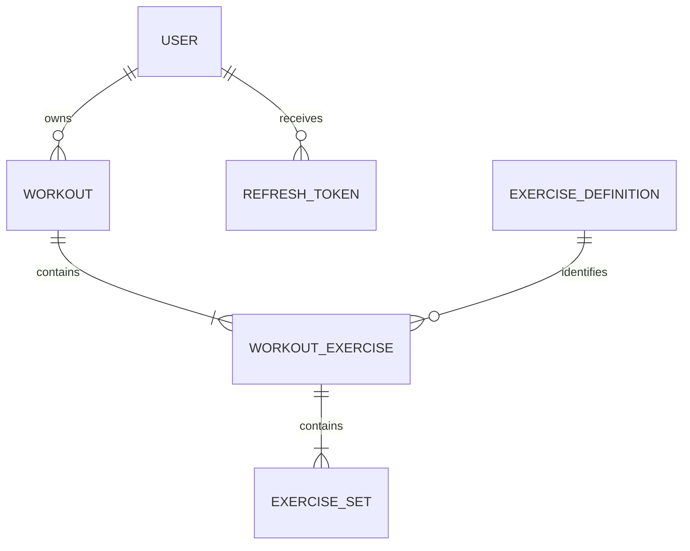

# Fitness Tracker API

[](https://github.com/cosmiinn75/fitness-tracker-api/actions/workflows/ci.yml)

A secure REST API for recording workouts and tracking strength-training progress, built with **Java 26**, **Spring Boot 4**, and **MySQL**.

The project goes beyond basic CRUD operations by implementing JWT authentication with refresh-token rotation, resource ownership, nested workout management, workout duplication, filtering and pagination, exercise history, estimated one-repetition maximum calculations, progress summaries, automated testing, Docker support, health monitoring, and continuous integration.

## Table of Contents

- [Main Features](#main-features)
- [Tech Stack](#tech-stack)
- [Architecture](#architecture)
- [Domain Model](#domain-model)
- [API Endpoints](#api-endpoints)
- [Authentication Flow](#authentication-flow)
- [Progress Tracking](#progress-tracking)
- [Request Examples](#request-examples)
- [Validation and Error Handling](#validation-and-error-handling)
- [Running with Docker](#running-with-docker)
- [Running Locally](#running-locally)
- [Environment Variables](#environment-variables)
- [Swagger and Health Check](#swagger-and-health-check)
- [Testing](#testing)
- [Continuous Integration](#continuous-integration)
- [Project Structure](#project-structure)
- [Security](#security)
- [Future Improvements](#future-improvements)
- [What I Learned](#what-i-learned)
- [Author](#author)

## Main Features

### Authentication and Security

- User registration and login
- Short-lived JWT access tokens
- Database-persisted refresh tokens
- Refresh-token rotation
- Logout and refresh-token revocation
- BCrypt password hashing
- Stateless Spring Security configuration
- JWT request filter
- Ownership checks for workouts and progress data
- Secrets and database credentials loaded from environment variables

### Exercise Definitions

- Create reusable exercise definitions
- Retrieve all exercise definitions
- Retrieve an exercise definition by ID
- Update an exercise name and muscle group
- Prevent duplicate exercise names while still allowing an exercise to keep its current name during an update
- Supported muscle groups: `CHEST`, `BACK`, `ARMS`, `SHOULDERS`, `LEGS`, and `CORE`

### Workout Management

- Create workouts with multiple exercises and sets
- Retrieve a workout by ID
- Retrieve paginated workout history
- Filter workouts by name and date range
- Sort workout history by date in descending order
- Update workout metadata with `PATCH`
- Replace an entire workout with `PUT`
- Delete workouts
- Duplicate a workout with all its exercises and sets while choosing a new name and date
- Restrict every workout operation to the authenticated owner

### Exercises and Sets Inside a Workout

- Add an exercise to an existing workout
- Change an exercise definition while preserving its sets
- Delete an exercise from a workout
- Add a set to an exercise
- Partially update a set
- Delete a set
- Automatically renumber exercises and sets after deletion
- Preserve exercise and set order through `exerciseNumber` and `setNumber`

### Progress Tracking

- Calculate the total volume of a workout
- Calculate total volume over the last seven days
- Calculate total volume from the beginning of the current month
- Retrieve a personal record for an exercise
- Retrieve paginated exercise history with optional date filters
- Calculate an estimated one-repetition maximum for each exercise-history entry
- Retrieve a compact activity summary for the authenticated user

### API Quality and Operations

- Request-body, path-variable, and pagination validation
- Centralized exception handling
- Consistent HTTP status codes
- Swagger UI and OpenAPI documentation
- JWT authorization support inside Swagger UI
- Spring Boot Actuator health endpoint
- Multi-stage Docker image
- Docker Compose setup for the API and MySQL
- Automated service, controller, and integration tests
- GitHub Actions continuous integration

## Tech Stack

| Area | Technology |
| --- | --- |
| Language | Java 26 |
| Framework | Spring Boot 4.1.0 |
| Web | Spring Web MVC |
| Security | Spring Security, JWT, BCrypt |
| Persistence | Spring Data JPA, Hibernate |
| Database | MySQL 8 |
| Validation | Jakarta Bean Validation |
| API documentation | Springdoc OpenAPI, Swagger UI |
| Monitoring | Spring Boot Actuator |
| Testing | JUnit, Mockito, MockMvc, Spring Boot Test |
| Build tool | Maven Wrapper |
| Containers | Docker, Docker Compose |
| CI | GitHub Actions |

## Architecture

The application follows a layered structure:

1. **Controllers** expose REST endpoints and validate incoming data.
2. **Services** contain authentication, workout, exercise, and progress business logic.
3. **Repositories** provide database access through Spring Data JPA.
4. **DTOs** separate the public API contract from persistence entities.
5. **Security components** validate JWTs and populate the Spring Security context.
6. **Global exception handling** converts business and validation exceptions into HTTP responses.

## Domain Model



- A user owns multiple workouts and refresh tokens.
- A workout contains ordered workout exercises.
- A workout exercise references a reusable exercise definition.
- A workout exercise contains ordered sets with weight, repetitions, and optional RIR.

## API Endpoints

All endpoints except authentication, Swagger/OpenAPI, and the health check require a valid access token.

Protected requests use:

```http
Authorization: Bearer <access-token>
```

### Authentication

| Method | Endpoint | Description |
| --- | --- | --- |
| `POST` | `/api/auth/register` | Register a user and receive access and refresh tokens |
| `POST` | `/api/auth/login` | Authenticate and receive access and refresh tokens |
| `POST` | `/api/auth/refresh` | Rotate a refresh token and receive a new token pair |
| `POST` | `/api/auth/logout` | Revoke a refresh token |

### Exercise Definitions

| Method | Endpoint | Description |
| --- | --- | --- |
| `GET` | `/api/exercises` | Retrieve all exercise definitions |
| `GET` | `/api/exercises/{id}` | Retrieve an exercise definition by ID |
| `POST` | `/api/exercises` | Create an exercise definition |
| `PUT` | `/api/exercises/{id}` | Update an exercise definition |

### Workouts

| Method | Endpoint | Description |
| --- | --- | --- |
| `GET` | `/api/workouts` | Retrieve paginated and filtered workouts |
| `GET` | `/api/workouts/{id}` | Retrieve one workout |
| `POST` | `/api/workouts` | Create a workout with exercises and sets |
| `PATCH` | `/api/workouts/{id}` | Update the workout name and date |
| `PUT` | `/api/workouts/{id}` | Replace the complete workout |
| `DELETE` | `/api/workouts/{id}` | Delete a workout |
| `POST` | `/api/workouts/{workoutId}/duplicate` | Duplicate a workout using a new name and date |

The workout-list endpoint supports these query parameters:

| Parameter | Default | Rules | Description |
| --- | --- | --- | --- |
| `page` | `0` | Minimum `0` | Page index |
| `size` | `10` | Between `1` and `100` | Page size |
| `name` | — | Optional | Case-insensitive partial name filter |
| `startDate` | — | `YYYY-MM-DD` | Inclusive start date |
| `endDate` | — | `YYYY-MM-DD` | Inclusive end date |

Example:

```http
GET /api/workouts?page=0&size=10&name=push&startDate=2026-07-01&endDate=2026-07-31
```

### Workout Exercises and Sets

| Method | Endpoint | Description |
| --- | --- | --- |
| `POST` | `/api/workouts/{workoutId}/exercises` | Add an exercise with its sets |
| `PATCH` | `/api/workouts/{workoutId}/exercises/{exerciseNumber}` | Change the exercise definition |
| `DELETE` | `/api/workouts/{workoutId}/exercises/{exerciseNumber}` | Delete and renumber an exercise |
| `POST` | `/api/workouts/{workoutId}/exercises/{exerciseNumber}/sets` | Add a set |
| `PATCH` | `/api/workouts/{workoutId}/exercises/{exerciseNumber}/sets/{setNumber}` | Partially update a set |
| `DELETE` | `/api/workouts/{workoutId}/exercises/{exerciseNumber}/sets/{setNumber}` | Delete and renumber a set |

### Progress

| Method | Endpoint | Description |
| --- | --- | --- |
| `GET` | `/api/progress/workouts/{workoutId}/volume` | Calculate the volume of one workout |
| `GET` | `/api/progress/weekly-volume` | Calculate volume over the last seven days |
| `GET` | `/api/progress/monthly-volume` | Calculate volume from the start of the current month |
| `GET` | `/api/progress/exercises/{exerciseDefinitionId}/personal-record` | Retrieve the personal record for an exercise |
| `GET` | `/api/progress/exercises/{exerciseDefinitionId}/history` | Retrieve paginated exercise history |
| `GET` | `/api/progress/summary` | Retrieve the user's activity summary |

Exercise history accepts the following optional query parameters:

```http
GET /api/progress/exercises/1/history?page=0&size=20&startDate=2026-06-01&endDate=2026-07-31
```

The default history page size is `20`, and the maximum is `100`. Results are returned from newest to oldest.

### Operations

| Method | Endpoint | Authentication | Description |
| --- | --- | --- | --- |
| `GET` | `/actuator/health` | Public | Return application health information |

## Authentication Flow

1. A user registers or logs in.
2. The API returns an access token and a refresh token.
3. The access token is sent in the `Authorization` header for protected requests.
4. Access tokens expire after **15 minutes**.
5. Refresh tokens are stored in MySQL and expire after **7 days**.
6. Calling `/api/auth/refresh` validates and revokes the current refresh token, then returns a new access token and refresh token.
7. Calling `/api/auth/logout` revokes the supplied refresh token.

This rotation mechanism prevents a refresh token from being reused after a successful refresh.

## Progress Tracking

### Workout Volume

Volume is calculated for every set and then summed:

```text
volume = weight × repetitions
```

### Personal Records

The best recorded set for an exercise is selected using this priority:

1. Highest weight
2. Highest repetitions when the weight is equal
3. Highest RIR when weight and repetitions are equal
4. Most recent workout date when all previous values are equal

### Estimated One-Repetition Maximum

Exercise history includes the highest estimated 1RM from the sets recorded in each workout. The calculation uses the Epley formula:

```text
estimated 1RM = weight × (1 + repetitions / 30)
```

This value is an estimate intended for progress comparison, not a guaranteed maximal lift.

### Progress Summary

`GET /api/progress/summary` returns:

- Total number of workouts
- Distinct training days during the last 7 days
- Distinct training days during the last 30 days
- Total number of sets during the last 7 days
- Date of the latest workout
- Most-trained exercise during the last 30 days, measured by number of sets

## Request Examples

### Register

```http
POST /api/auth/register
Content-Type: application/json
```

```json
{
  "username": "cosmin",
  "email": "cosmin@example.com",
  "password": "strongPassword123"
}
```

Example response:

```json
{
  "accessToken": "<jwt-access-token>",
  "refreshToken": "<refresh-token>"
}
```

### Create an Exercise Definition

```http
POST /api/exercises
Authorization: Bearer <access-token>
Content-Type: application/json
```

```json
{
  "exerciseName": "Bench Press",
  "muscleGroup": "CHEST"
}
```

### Create a Workout

```http
POST /api/workouts
Authorization: Bearer <access-token>
Content-Type: application/json
```

```json
{
  "workoutName": "Push Day",
  "date": "2026-07-21",
  "exerciseRequests": [
    {
      "exerciseDefinitionId": 1,
      "setRequests": [
        {
          "weight": 100.0,
          "reps": 5,
          "rir": 2
        },
        {
          "weight": 95.0,
          "reps": 8,
          "rir": 1
        }
      ]
    }
  ]
}
```

### Partially Update a Set

Only the supplied fields are changed.

```http
PATCH /api/workouts/10/exercises/1/sets/2
Authorization: Bearer <access-token>
Content-Type: application/json
```

```json
{
  "reps": 9,
  "rir": 0
}
```

### Duplicate a Workout

```http
POST /api/workouts/10/duplicate
Authorization: Bearer <access-token>
Content-Type: application/json
```

```json
{
  "workoutName": "Push Day - Week 2",
  "date": "2026-07-28"
}
```

The new workout receives copies of the original exercises and sets. The original workout remains unchanged.

### Progress Summary Response

```json
{
  "totalWorkouts": 42,
  "trainingDaysLast7Days": 4,
  "trainingDaysLast30Days": 15,
  "totalSetsLast7Days": 58,
  "lastWorkoutDate": "2026-07-21",
  "mostTrainedExerciseLast30Days": "Bench Press"
}
```

### Exercise History Response

```json
{
  "content": [
    {
      "workoutId": 10,
      "workoutExerciseId": 31,
      "exerciseNumber": 1,
      "exerciseName": "Bench Press",
      "estimatedOneRepMax": 116.67,
      "workoutDate": "2026-07-21",
      "setResponses": [
        {
          "id": 91,
          "setNumber": 1,
          "weight": 100.0,
          "reps": 5,
          "rir": 2
        }
      ]
    }
  ],
  "page": 0,
  "size": 20,
  "totalElements": 1,
  "totalPages": 1,
  "first": true,
  "last": true
}
```

## Validation and Error Handling

The API validates:

- Usernames, email addresses, and passwords
- Exercise names and muscle groups
- Workout names and dates
- Exercise-definition IDs
- Weight, repetitions, and RIR values
- Positive path variables
- Page index and page size
- Start and end date order
- Non-empty workout exercise and set collections

Custom exceptions are translated by a global exception handler into appropriate responses such as:

- `400 Bad Request` for invalid input or date ranges
- `401 Unauthorized` for invalid credentials, tokens, or authentication
- `404 Not Found` for missing workouts, exercises, sets, or records
- `409 Conflict` for duplicate accounts or exercise names

Example business-error response:

```json
{
  "error": "Not found",
  "message": "Workout not found"
}
```

Validation errors are returned as a map of field names and validation messages.

## Running with Docker

### Requirements

- Docker
- Docker Compose

### Start the Application

```bash
git clone https://github.com/cosmiinn75/fitness-tracker-api.git
cd fitness-tracker-api
cp .env.example .env
```

Update `.env` with your own database password and a long JWT secret, then run:

```bash
docker compose up --build
```

Available services:

- API: `http://localhost:8080`
- MySQL from the host: `localhost:3307`
- Swagger UI: `http://localhost:8080/swagger-ui/index.html`
- Health check: `http://localhost:8080/actuator/health`

Stop the containers with:

```bash
docker compose down
```

The MySQL data is stored in the named Docker volume `fitness_tracker_mysql_data`.

## Running Locally

### Requirements

- Java 26
- MySQL 8

Create a MySQL database named `fitness_tracker_db`, then create the environment file:

```bash
cp .env.example .env
```

Update the values in `.env`, then start the application:

```bash
./mvnw spring-boot:run
```

On Windows:

```powershell
mvnw.cmd spring-boot:run
```

The API starts on `http://localhost:8080`.

## Environment Variables

| Variable | Required | Example | Description |
| --- | --- | --- | --- |
| `DB_URL` | Yes | `jdbc:mysql://localhost:3306/fitness_tracker_db` | JDBC database URL |
| `DB_USERNAME` | Yes | `root` | Database username |
| `DB_PASSWORD` | Yes | `your_local_password` | Database password |
| `JWT_SECRET` | Yes | A long random value | Secret used to sign JWTs |
| `SPRING_JPA_HIBERNATE_DDL_AUTO` | No | `update` | Overrides the Hibernate schema strategy |

Do not commit the real `.env` file or production secrets.

## Swagger and Health Check

Swagger UI is available at:

```text
http://localhost:8080/swagger-ui/index.html
```

The OpenAPI specification is available at:

```text
http://localhost:8080/v3/api-docs
```

To call protected endpoints from Swagger:

1. Register or log in.
2. Copy the returned access token.
3. Select **Authorize** in Swagger UI.
4. Enter the token and call a protected endpoint.

The public Actuator health endpoint is available at:

```text
http://localhost:8080/actuator/health
```

Example response:

```json
{
  "status": "UP"
}
```

## Testing

Run the complete test suite with:

```bash
./mvnw clean verify
```

On Windows:

```powershell
mvnw.cmd clean verify
```

The current project contains **70 automated test methods** across:

- Service unit tests with JUnit and Mockito
- Controller tests with MockMvc
- Integration tests using Spring Boot, real repositories, and MySQL
- Authentication and refresh-token tests
- Resource-ownership tests
- Validation and exception-response tests
- Workout duplication tests
- Exercise-history and progress-summary tests

## Continuous Integration

The GitHub Actions workflow runs on every push and pull request targeting `main`.

The pipeline:

1. Checks out the repository.
2. Starts a MySQL 8 service container.
3. Configures Java 26 and the Maven dependency cache.
4. Builds the project.
5. Executes the complete test suite with `./mvnw clean verify`.

The build status is shown by the badge at the top of this README.

## Project Structure

```text
fitness-tracker-api/
├── .github/workflows/        # GitHub Actions CI
├── src/main/java/com/cosmin/fitness_tracker_api/
│   ├── Controller/           # REST controllers
│   ├── DTO/                  # Request and response models
│   ├── Enum/                 # Muscle-group values
│   ├── Exception/            # Custom exceptions and global handling
│   ├── Model/                # JPA entities
│   ├── Repository/           # Spring Data JPA repositories
│   ├── Security/             # JWT, Spring Security, and OpenAPI config
│   └── Service/              # Business logic
├── src/main/resources/       # Application configuration
├── src/test/java/            # Unit, controller, and integration tests
├── src/test/resources/       # Test configuration
├── .env.example              # Environment-variable template
├── docker-compose.yml        # API and MySQL services
├── Dockerfile                # Multi-stage application image
├── pom.xml                   # Maven configuration
└── README.md
```

## Security

- Passwords are stored using BCrypt hashes.
- The application does not use HTTP sessions.
- Access tokens are short-lived and signed using `HS256`.
- Refresh tokens are persisted, validated, rotated, and revocable.
- CSRF protection is disabled because the API uses stateless bearer-token authentication.
- Database credentials and JWT secrets are externalized.
- Workout and progress queries include the authenticated username.
- A user cannot retrieve or modify another user's workouts through their IDs.
- Authentication, Swagger/OpenAPI, and `/actuator/health` are the only public endpoint groups.

Production environments should use a long random JWT secret, dedicated credentials, HTTPS, and separate configuration from development and CI.

## Future Improvements

- Deploy the API to a public cloud platform
- Replace automatic schema updates with Flyway database migrations
- Use Testcontainers for isolated integration-test databases
- Optimize nested workout and summary queries to reduce potential N+1 queries
- Add configurable sorting to workout and exercise history
- Add user profile and password-management endpoints
- Add password reset and email verification
- Add rate limiting for authentication endpoints
- Add structured logging and additional Actuator metrics
- Add API versioning

## What I Learned

While building this project, I practiced:

- Designing and documenting REST APIs with Spring Boot
- Separating controllers, services, repositories, entities, and DTOs
- Modeling nested JPA relationships
- Implementing JWT authentication and Spring Security filters
- Implementing persistent refresh tokens, rotation, expiration, and revocation
- Protecting user-owned resources
- Using `POST`, `GET`, `PUT`, `PATCH`, and `DELETE` correctly
- Implementing pagination, filtering, and date-range validation
- Maintaining ordered nested resources after deletion
- Duplicating aggregate data with child entities
- Calculating workout volume, personal records, activity summaries, and estimated 1RM
- Building exercise-specific progress history
- Handling validation and business exceptions globally
- Writing unit tests with JUnit and Mockito
- Testing REST controllers with MockMvc
- Writing database-backed integration tests
- Containerizing Spring Boot and MySQL with Docker Compose
- Automating builds and tests with GitHub Actions
- Exposing API documentation and operational health checks

## Status

The core API is implemented and actively maintained as a backend portfolio project. The current `main` branch is covered by automated tests and a successful continuous-integration pipeline.

## Author

**Anghel Cosmin**

GitHub: [cosmiinn75](https://github.com/cosmiinn75)
