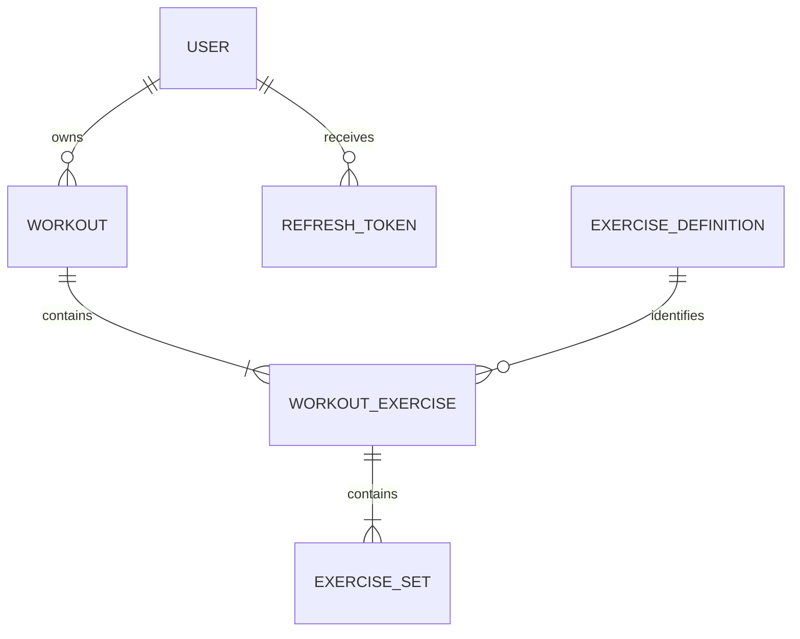

# Fitness Tracker API

[](https://github.com/cosmiinn75/fitness-tracker-api/actions/workflows/ci.yml)

A secure REST API for recording strength-training workouts and tracking progress, built with **Java 26**, **Spring Boot 4.1**, and **MySQL 8**.

This portfolio project goes beyond basic CRUD operations. It includes JWT authentication with refresh-token rotation, user-owned resources, nested workout management, filtering and pagination, workout duplication, exercise history, estimated one-repetition maximum calculations, paginated personal records powered by a native SQL window function, Flyway database migrations, automated tests, Docker, health monitoring, and continuous integration.

## Table of Contents

- [Highlights](#highlights)
- [Features](#features)
- [Tech Stack](#tech-stack)
- [Architecture](#architecture)
- [Domain Model](#domain-model)
- [Database Migrations](#database-migrations)
- [API Endpoints](#api-endpoints)
- [Authentication Flow](#authentication-flow)
- [Progress Analytics](#progress-analytics)
- [Request and Response Examples](#request-and-response-examples)
- [Validation and Error Handling](#validation-and-error-handling)
- [Running with Docker](#running-with-docker)
- [Running Locally](#running-locally)
- [Environment Variables](#environment-variables)
- [Swagger and Health Check](#swagger-and-health-check)
- [Testing](#testing)
- [Continuous Integration](#continuous-integration)
- [Project Structure](#project-structure)
- [Security](#security)
- [Roadmap](#roadmap)
- [What I Learned](#what-i-learned)
- [Author](#author)

## Highlights

- Secure JWT authentication with access and refresh tokens
- Persistent refresh-token rotation and revocation
- Complete nested CRUD for workouts, exercises, and sets
- Ownership protection for every user-specific operation
- Pagination, filtering, date ranges, and deterministic ordering
- Paginated personal records selected with `ROW_NUMBER()` and `PARTITION BY`
- Flyway-managed schema with Hibernate validation
- 76 automated unit, controller, and integration tests
- Dockerized API and MySQL environment
- Swagger/OpenAPI documentation with JWT authorization
- Actuator health monitoring
- GitHub Actions CI with a real MySQL service container

## Features

### Authentication and Security

- Register and authenticate users
- Generate short-lived JWT access tokens
- Persist refresh tokens in MySQL
- Rotate refresh tokens when a new access token is requested
- Revoke refresh tokens during rotation and logout
- Hash passwords with BCrypt
- Use stateless Spring Security configuration
- Validate access tokens through a custom JWT filter
- Load database credentials and JWT secrets from environment variables
- Restrict workouts and progress data to the authenticated owner

### Exercise Definitions

- Create reusable exercise definitions
- Retrieve all exercise definitions
- Retrieve one exercise definition by ID
- Update an exercise name and muscle group
- Prevent duplicate exercise names
- Allow an exercise to keep its current name during an update
- Supported muscle groups: `CHEST`, `BACK`, `ARMS`, `SHOULDERS`, `LEGS`, and `CORE`

### Workout Management

- Create workouts containing multiple exercises and sets
- Retrieve a workout by ID
- Retrieve paginated workout history
- Filter workouts by partial name and date range
- Sort workout history by date in descending order
- Update workout metadata with `PATCH`
- Replace an entire workout with `PUT`
- Delete workouts
- Duplicate a workout with all its exercises and sets while selecting a new name and date
- Protect every operation with authenticated-user ownership checks

### Exercises and Sets Inside a Workout

- Add an exercise and its sets to an existing workout
- Change the exercise definition while preserving recorded sets
- Delete an exercise from a workout
- Add a set to an exercise
- Partially update a set
- Delete a set
- Preserve ordering with `exerciseNumber` and `setNumber`
- Automatically renumber exercises and sets after deletion

### Progress Analytics

- Calculate the volume of a workout
- Calculate volume for the last seven days
- Calculate volume from the beginning of the current month
- Retrieve the personal record for one exercise
- Retrieve all personal records with database-level pagination
- Select one best set per exercise with a native MySQL window-function query
- Retrieve paginated exercise history with optional date filters
- Calculate an estimated one-repetition maximum for each history entry
- Retrieve an activity summary for the authenticated user

### Database and Operations

- Manage the schema with versioned Flyway migrations
- Run Flyway before Hibernate starts
- Validate entity-to-schema compatibility with `ddl-auto=validate`
- Document the API through Springdoc OpenAPI and Swagger UI
- Authorize Swagger requests with JWT bearer tokens
- Expose a public Actuator health endpoint
- Build the API with a multi-stage Docker image
- Start the API and MySQL together through Docker Compose
- Build and test every push and pull request through GitHub Actions

## Tech Stack

| Area | Technology |
| --- | --- |
| Language | Java 26 |
| Framework | Spring Boot 4.1.0 |
| Web | Spring Web MVC |
| Security | Spring Security, JWT, BCrypt |
| Persistence | Spring Data JPA, Hibernate |
| Database | MySQL 8 |
| Schema migrations | Flyway |
| Validation | Jakarta Bean Validation |
| API documentation | Springdoc OpenAPI, Swagger UI |
| Monitoring | Spring Boot Actuator |
| Testing | JUnit 5, Mockito, MockMvc, Spring Boot Test |
| Build | Maven Wrapper |
| Containers | Docker, Docker Compose |
| CI | GitHub Actions |

## Architecture

The application follows a layered architecture:

1. **Controllers** expose REST endpoints and validate incoming parameters and request bodies.
2. **Services** implement authentication, ownership, workout, exercise, and progress business rules.
3. **Repositories** access MySQL through Spring Data JPA, JPQL, and native SQL where appropriate.
4. **DTOs** keep the public API contract separate from persistence entities.
5. **Projections** map optimized native-query results without loading full JPA entity graphs.
6. **Security components** validate JWTs and populate the Spring Security context.
7. **Global exception handling** converts validation and business exceptions into HTTP responses.
8. **Flyway migrations** version and reproduce the database schema.

## Domain Model



- A user owns multiple workouts and refresh tokens.
- A workout contains ordered workout exercises.
- A workout exercise references one reusable exercise definition.
- A workout exercise contains ordered sets.
- A set records weight, repetitions, and optional repetitions in reserve (`RIR`).

## Database Migrations

The schema is managed by Flyway rather than being generated automatically by Hibernate.

Migration files are stored in:

```text
src/main/resources/db/migration
```

The initial migration is:

```text
V1__create_initial_schema.sql
V2__add_database_indexes.sql
```

It creates the following tables:

- `users`
- `refresh_tokens`
- `exercise_definitions`
- `workouts`
- `workout_exercises`
- `exercise_sets`

Application startup follows this sequence:

1. The application connects to MySQL.
2. Flyway checks `flyway_schema_history`.
3. Flyway applies every migration that has not yet run.
4. Hibernate validates the resulting schema against the JPA entities.
5. The application starts only when the schema is valid.

Applied migrations must not be edited. Every future schema change should be introduced through a new version such as `V2__add_indexes.sql`.

## API Endpoints

All endpoints except authentication, Swagger/OpenAPI, and the Actuator health endpoint require a valid JWT access token.

Protected requests use:

```http
Authorization: Bearer <access-token>
```

### Authentication

| Method | Endpoint | Description |
| --- | --- | --- |
| `POST` | `/api/auth/register` | Register a user and return an access/refresh-token pair |
| `POST` | `/api/auth/login` | Authenticate and return an access/refresh-token pair |
| `POST` | `/api/auth/refresh` | Rotate a refresh token and return a new token pair |
| `POST` | `/api/auth/logout` | Revoke a refresh token |

### Exercise Definitions

| Method | Endpoint | Description |
| --- | --- | --- |
| `GET` | `/api/exercises` | Retrieve all exercise definitions |
| `GET` | `/api/exercises/{id}` | Retrieve an exercise definition by ID |
| `POST` | `/api/exercises` | Create an exercise definition |
| `PUT` | `/api/exercises/{id}` | Replace an exercise definition |

### Workouts

| Method | Endpoint | Description |
| --- | --- | --- |
| `GET` | `/api/workouts` | Retrieve paginated and filtered workouts |
| `GET` | `/api/workouts/{id}` | Retrieve one workout |
| `POST` | `/api/workouts` | Create a workout with exercises and sets |
| `PATCH` | `/api/workouts/{id}` | Update the workout name and date |
| `PUT` | `/api/workouts/{id}` | Replace the complete workout |
| `DELETE` | `/api/workouts/{id}` | Delete a workout |
| `POST` | `/api/workouts/{workoutId}/duplicate` | Duplicate a workout with a new name and date |

`GET /api/workouts` supports:

| Parameter | Default | Rules | Description |
| --- | --- | --- | --- |
| `page` | `0` | Minimum `0` | Zero-based page index |
| `size` | `10` | From `1` to `100` | Page size |
| `name` | — | Optional | Case-insensitive partial-name filter |
| `startDate` | — | `YYYY-MM-DD` | Inclusive start date |
| `endDate` | — | `YYYY-MM-DD` | Inclusive end date |

Example:

```http
GET /api/workouts?page=0&size=10&name=push&startDate=2026-07-01&endDate=2026-07-31
```

### Workout Exercises and Sets

| Method | Endpoint | Description |
| --- | --- | --- |
| `POST` | `/api/workouts/{workoutId}/exercises` | Add an exercise and its sets |
| `PATCH` | `/api/workouts/{workoutId}/exercises/{exerciseNumber}` | Change the exercise definition |
| `DELETE` | `/api/workouts/{workoutId}/exercises/{exerciseNumber}` | Delete and renumber an exercise |
| `POST` | `/api/workouts/{workoutId}/exercises/{exerciseNumber}/sets` | Add a set |
| `PATCH` | `/api/workouts/{workoutId}/exercises/{exerciseNumber}/sets/{setNumber}` | Partially update a set |
| `DELETE` | `/api/workouts/{workoutId}/exercises/{exerciseNumber}/sets/{setNumber}` | Delete and renumber a set |

### Progress

| Method | Endpoint | Description |
| --- | --- | --- |
| `GET` | `/api/progress/workouts/{workoutId}/volume` | Calculate the volume of one workout |
| `GET` | `/api/progress/weekly-volume` | Calculate volume for the last seven days |
| `GET` | `/api/progress/monthly-volume` | Calculate volume from the start of the current month |
| `GET` | `/api/progress/exercises/{exerciseDefinitionId}/personal-record` | Retrieve the best set for one exercise |
| `GET` | `/api/progress/personal-records` | Retrieve paginated personal records for all exercises |
| `GET` | `/api/progress/exercises/{exerciseDefinitionId}/history` | Retrieve paginated exercise history |
| `GET` | `/api/progress/summary` | Retrieve the authenticated user's activity summary |

Personal-record pagination parameters:

| Parameter | Default | Rules |
| --- | --- | --- |
| `page` | `0` | Minimum `0` |
| `size` | `20` | From `1` to `100` |

Exercise history accepts the same pagination parameters plus optional `startDate` and `endDate` filters:

```http
GET /api/progress/exercises/1/history?page=0&size=20&startDate=2026-06-01&endDate=2026-07-31
```

### Operations

| Method | Endpoint | Authentication | Description |
| --- | --- | --- | --- |
| `GET` | `/actuator/health` | Public | Return application health information |

## Authentication Flow

1. A user registers or logs in.
2. The API returns an access token and a refresh token.
3. The client sends the access token in the `Authorization` header.
4. Access tokens expire after **15 minutes**.
5. Refresh tokens are stored in MySQL and expire after **7 days**.
6. `/api/auth/refresh` validates and revokes the current refresh token.
7. The API returns a new access token and refresh token.
8. `/api/auth/logout` revokes the supplied refresh token.

A successfully rotated refresh token cannot be reused.

## Progress Analytics

### Workout Volume

Volume is calculated for every set and then summed:

```text
volume = weight × repetitions
```

### Personal Records

The best recorded set is selected in this order:

1. Highest weight
2. Highest repetitions when weight is equal
3. Highest RIR when weight and repetitions are equal
4. Most recent workout date when the previous values are equal
5. Deterministic workout and set ordering for any remaining tie

The paginated endpoint performs this selection directly in MySQL. It uses:

```sql
ROW_NUMBER() OVER (
    PARTITION BY exercise_definition_id
    ORDER BY weight DESC, reps DESC, rir DESC, date DESC
)
```

Only one result per exercise is returned. The query filters by the authenticated username, uses an interface projection, and supplies a dedicated `countQuery` so Spring Data can build correct page metadata.

### Estimated One-Repetition Maximum

Exercise history includes the highest estimated 1RM from each workout entry. It uses the Epley formula:

```text
estimated 1RM = weight × (1 + repetitions / 30)
```

The value is intended for progress comparison and is not a guaranteed maximal lift.

### Progress Summary

`GET /api/progress/summary` returns:

- Total number of workouts
- Distinct training days during the last 7 days
- Distinct training days during the last 30 days
- Total sets recorded during the last 7 days
- Date of the latest workout
- Most-trained exercise during the last 30 days, measured by set count

## Request and Response Examples

### Register

```http
POST /api/auth/register
Content-Type: application/json
```

```json
{
  "username": "cosmin",
  "email": "cosmin@example.com",
  "password": "strongPassword123"
}
```

Example response:

```json
{
  "accessToken": "<jwt-access-token>",
  "refreshToken": "<refresh-token>"
}
```

### Create an Exercise Definition

```http
POST /api/exercises
Authorization: Bearer <access-token>
Content-Type: application/json
```

```json
{
  "exerciseName": "Bench Press",
  "muscleGroup": "CHEST"
}
```

### Create a Workout

```http
POST /api/workouts
Authorization: Bearer <access-token>
Content-Type: application/json
```

```json
{
  "workoutName": "Push Day",
  "date": "2026-07-22",
  "exerciseRequests": [
    {
      "exerciseDefinitionId": 1,
      "setRequests": [
        {
          "weight": 80.0,
          "reps": 8,
          "rir": 2
        },
        {
          "weight": 100.0,
          "reps": 5,
          "rir": 1
        }
      ]
    }
  ]
}
```

### Partially Update a Set

Only supplied fields are changed.

```http
PATCH /api/workouts/10/exercises/1/sets/2
Authorization: Bearer <access-token>
Content-Type: application/json
```

```json
{
  "reps": 9,
  "rir": 0
}
```

### Duplicate a Workout

```http
POST /api/workouts/10/duplicate
Authorization: Bearer <access-token>
Content-Type: application/json
```

```json
{
  "workoutName": "Push Day - Week 2",
  "date": "2026-07-29"
}
```

The original workout remains unchanged.

### Paginated Personal Records

```http
GET /api/progress/personal-records?page=0&size=2
Authorization: Bearer <access-token>
```

```json
{
  "content": [
    {
      "exerciseDefinitionId": 1,
      "exerciseName": "Bench Press",
      "weight": 105.0,
      "reps": 3,
      "rir": 0,
      "date": "2026-07-22"
    },
    {
      "exerciseDefinitionId": 2,
      "exerciseName": "Squat",
      "weight": 145.0,
      "reps": 4,
      "rir": 0,
      "date": "2026-07-22"
    }
  ],
  "page": 0,
  "size": 2,
  "totalElements": 7,
  "totalPages": 4,
  "first": true,
  "last": false
}
```

When the user has no recorded sets, the endpoint returns `200 OK` with an empty `content` list.

### Progress Summary

```json
{
  "totalWorkouts": 42,
  "trainingDaysLast7Days": 4,
  "trainingDaysLast30Days": 15,
  "totalSetsLast7Days": 58,
  "lastWorkoutDate": "2026-07-22",
  "mostTrainedExerciseLast30Days": "Bench Press"
}
```

### Exercise History

```json
{
  "content": [
    {
      "workoutId": 10,
      "workoutExerciseId": 31,
      "exerciseNumber": 1,
      "exerciseName": "Bench Press",
      "estimatedOneRepMax": 122.5,
      "workoutDate": "2026-07-22",
      "setResponses": [
        {
          "id": 91,
          "setNumber": 1,
          "weight": 105.0,
          "reps": 5,
          "rir": 1
        }
      ]
    }
  ],
  "page": 0,
  "size": 20,
  "totalElements": 1,
  "totalPages": 1,
  "first": true,
  "last": true
}
```

## Validation and Error Handling

The API validates:

- Usernames, email addresses, and passwords
- Exercise names and muscle groups
- Workout names and dates
- Exercise-definition IDs
- Weight, repetitions, and RIR values
- Positive path variables
- Page indexes and page sizes
- Start and end date ordering
- Non-empty exercise and set collections

The global exception handler translates validation and business failures into responses such as:

- `400 Bad Request` for invalid input or date ranges
- `401 Unauthorized` for invalid credentials, tokens, or authentication
- `404 Not Found` for missing workouts, exercises, sets, or records
- `409 Conflict` for duplicate accounts or exercise names

Example business-error response:

```json
{
  "error": "Not found",
  "message": "Workout not found"
}
```

Validation failures are returned as field-to-message mappings.

## Running with Docker

### Requirements

- Docker
- Docker Compose

### Start the Application

```bash
git clone https://github.com/cosmiinn75/fitness-tracker-api.git
cd fitness-tracker-api
cp .env.example .env
```

Update `.env` with a database password and a long JWT secret, then run:

```bash
docker compose up --build
```

Docker Compose:

1. Starts MySQL 8.
2. Waits for the database health check.
3. Starts the API.
4. Runs Flyway migrations automatically.
5. Validates the schema through Hibernate.

Available services:

- API: `http://localhost:8080`
- MySQL from the host: `localhost:3307`
- Swagger UI: `http://localhost:8080/swagger-ui/index.html`
- Health check: `http://localhost:8080/actuator/health`

Stop the services:

```bash
docker compose down
```

MySQL data is preserved in the named volume `fitness_tracker_mysql_data`.

To also remove the local database volume and recreate an empty database:

```bash
docker compose down -v
```

This permanently removes the data stored in that Docker volume.

## Running Locally

### Requirements

- Java 26
- MySQL 8

Create an empty database:

```sql
CREATE DATABASE fitness_tracker_db;
```

Flyway creates the tables when the application starts.

Create the environment file:

```bash
cp .env.example .env
```

Update `.env`, then start the application:

```bash
./mvnw spring-boot:run
```

On Windows PowerShell:

```powershell
.\mvnw.cmd spring-boot:run
```

The API starts on `http://localhost:8080`.

## Environment Variables

| Variable | Required | Example | Description |
| --- | --- | --- | --- |
| `DB_URL` | Yes | `jdbc:mysql://localhost:3306/fitness_tracker_db` | JDBC database URL |
| `DB_USERNAME` | Yes | `root` | Database username |
| `DB_PASSWORD` | Yes | `your_local_password` | Database password |
| `JWT_SECRET` | Yes | A long random value | Secret used to sign JWT access tokens |
| `SPRING_JPA_HIBERNATE_DDL_AUTO` | No | `validate` | Optional Hibernate schema-strategy override |

When running the API inside Docker, the database URL uses the Compose service name and internal port:

```text
jdbc:mysql://mysql:3306/fitness_tracker_db
```

Do not commit `.env` or real production secrets.

## Swagger and Health Check

Swagger UI:

```text
http://localhost:8080/swagger-ui/index.html
```

OpenAPI document:

```text
http://localhost:8080/v3/api-docs
```

To call protected endpoints through Swagger:

1. Register or log in.
2. Copy the access token.
3. Select **Authorize** in Swagger UI.
4. Paste the token.
5. Call a protected endpoint.

Public health endpoint:

```text
http://localhost:8080/actuator/health
```

Example response:

```json
{
  "status": "UP"
}
```

## Testing

Run the complete suite:

```bash
./mvnw clean verify
```

On Windows PowerShell:

```powershell
.\mvnw.cmd clean verify
```

The project currently contains **76 automated test methods**, including:

- Service unit tests with JUnit and Mockito
- Controller tests with MockMvc
- Spring Boot integration tests backed by MySQL
- Authentication and refresh-token tests
- Resource-ownership tests
- Validation and exception-response tests
- Workout duplication tests
- Exercise-history and progress-summary tests
- Native personal-record query integration tests
- Personal-record pagination and projection-mapping tests

The personal-record repository tests verify:

- Weight, repetitions, RIR, and date priority
- Exclusion of records belonging to another user
- Correct `totalElements` and `totalPages`
- Multiple pages with different exercise records
- An empty result for a user without recorded sets

## Continuous Integration

The GitHub Actions workflow runs for pushes and pull requests targeting `main`.

The pipeline:

1. Checks out the repository.
2. Starts a MySQL 8 service container.
3. Configures Java 26 and the Maven dependency cache.
4. Runs Flyway against the test database.
5. Builds the project.
6. Executes `./mvnw --batch-mode clean verify`.

The current build status is displayed by the badge at the top of this README.

## Project Structure

```text
fitness-tracker-api/
├── .github/
│   └── workflows/
│       └── ci.yml
├── src/
│   ├── main/
│   │   ├── java/com/cosmin/fitness_tracker_api/
│   │   │   ├── Controller/
│   │   │   ├── DTO/
│   │   │   ├── Enum/
│   │   │   ├── Exception/
│   │   │   ├── Model/
│   │   │   ├── Repository/
│   │   │   │   └── Projection/
│   │   │   ├── Security/
│   │   │   └── Service/
│   │   └── resources/
│   │       ├── db/migration/
│   │       │   └── V1__create_initial_schema.sql
│   │       └── application.properties
│   └── test/
│       ├── java/com/cosmin/fitness_tracker_api/
│       │   ├── ControllerTest/
│       │   ├── IntegrationTest/
│       │   └── ServiceTest/
│       └── resources/
│           └── application-test.properties
├── .env.example
├── docker-compose.yml
├── Dockerfile
├── pom.xml
└── README.md
```

## Security

- Passwords are stored as BCrypt hashes.
- The API does not use HTTP sessions.
- Access tokens are signed with `HS256` and expire after 15 minutes.
- Refresh tokens are persisted, validated, rotated, and revocable.
- Refresh tokens expire after 7 days.
- CSRF is disabled because the API uses stateless bearer-token authentication.
- Database credentials and JWT secrets are externalized.
- Workouts are queried by both resource ID and authenticated username.
- Progress queries filter by the authenticated username.
- Users cannot read or modify another user's workouts through their IDs.
- Authentication, Swagger/OpenAPI, and `/actuator/health` are the only public endpoint groups.

Production deployments should use HTTPS, dedicated database credentials, a long random JWT secret, and separate production configuration.

## Roadmap

- Use Testcontainers for isolated integration-test databases
- Add JaCoCo coverage reporting
- Deploy the API to a public cloud platform
- Add structured logging and additional Actuator metrics
- Add rate limiting to authentication endpoints
- Add training goals and goal-progress tracking
- Add profile and password-management endpoints
- Optimize remaining nested summary queries after measuring their SQL behavior

## What I Learned

While building this project, I practiced:

- Designing and documenting REST APIs with Spring Boot
- Separating controllers, services, repositories, entities, projections, and DTOs
- Modeling nested JPA relationships and aggregate ownership
- Implementing JWT authentication and Spring Security filters
- Implementing refresh-token persistence, rotation, expiration, and revocation
- Protecting user-owned resources
- Using `POST`, `GET`, `PUT`, `PATCH`, and `DELETE` appropriately
- Implementing pagination, filtering, sorting, and date-range validation
- Maintaining ordered nested resources after deletion
- Duplicating aggregates with their child entities
- Calculating workout volume, personal records, progress summaries, and estimated 1RM
- Using MySQL window functions to select one ranked result per group
- Returning native query results through interface projections
- Implementing database-level pagination with a dedicated count query
- Managing schema evolution with Flyway
- Validating the database schema through Hibernate
- Writing unit tests with JUnit and Mockito
- Testing controllers with MockMvc
- Writing database-backed repository integration tests
- Containerizing Spring Boot and MySQL with Docker Compose
- Automating builds and tests with GitHub Actions
- Exposing API documentation and operational health checks

## Status

The core API is implemented and actively maintained as a backend portfolio project. The `main` branch includes automated tests and continuous integration.

## Author

**Anghel Cosmin**

GitHub: [cosmiinn75](https://github.com/cosmiinn75)
