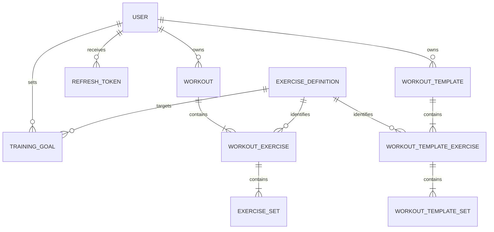

# Fitness Tracker API

[](https://github.com/cosmiinn75/fitness-tracker-api/actions/workflows/ci.yml)

A secure REST API for recording strength-training workouts and tracking progress, built with **Java 26**, **Spring Boot 4.1**, and **MySQL 8**.

This portfolio project goes beyond basic CRUD operations. It includes JWT authentication with refresh-token rotation, global system exercises and user-owned custom exercises, nested workout management, reusable workout templates, filtering and pagination, workout duplication, exercise history, estimated one-repetition maximum calculations, paginated personal records powered by a native SQL window function, and a complete training-goal lifecycle with automatic completion and expiration. The project also includes Flyway database migrations, automated tests, Docker, health monitoring, and continuous integration.

## Table of Contents

- [Highlights](#highlights)
- [Features](#features)
- [Tech Stack](#tech-stack)
- [Architecture](#architecture)
- [Domain Model](#domain-model)
- [Database Migrations](#database-migrations)
- [API Endpoints](#api-endpoints)
- [Authentication Flow](#authentication-flow)
- [Progress Analytics](#progress-analytics)
- [Training Goal Lifecycle](#training-goal-lifecycle)
- [Workout Template Workflow](#workout-template-workflow)
- [Request and Response Examples](#request-and-response-examples)
- [Validation and Error Handling](#validation-and-error-handling)
- [Running with Docker](#running-with-docker)
- [Running Locally](#running-locally)
- [Environment Variables](#environment-variables)
- [Swagger and Health Check](#swagger-and-health-check)
- [Testing](#testing)
- [Continuous Integration](#continuous-integration)
- [Project Structure](#project-structure)
- [Security](#security)
- [Roadmap](#roadmap)
- [What I Learned](#what-i-learned)
- [Author](#author)

## Highlights

- Secure JWT authentication with access and refresh tokens
- Persistent refresh-token rotation and revocation
- Complete nested CRUD for workouts, exercises, and sets
- Global `SYSTEM` exercises combined with user-owned `CUSTOM` exercises
- Reusable workout templates with ordered exercises and target sets
- Read-only workout-draft generation from saved templates
- Ownership protection for every user-specific operation
- Pagination, filtering, date ranges, and deterministic ordering
- Paginated personal records selected with `ROW_NUMBER()` and `PARTITION BY`
- User-owned training goals with automatic completion, cancellation, and expiration
- Flyway-managed schema with Hibernate validation
- Automated unit, controller, and database-backed integration tests
- Dockerized API and MySQL environment
- Swagger/OpenAPI documentation with JWT authorization
- Actuator health monitoring
- GitHub Actions CI with a real MySQL service container

## Features

### Authentication and Security

- Register and authenticate users
- Generate short-lived JWT access tokens
- Persist refresh tokens in MySQL
- Rotate refresh tokens when a new access token is requested
- Revoke refresh tokens during rotation and logout
- Hash passwords with BCrypt
- Use stateless Spring Security configuration
- Validate access tokens through a custom JWT filter
- Load database credentials and JWT secrets from environment variables
- Restrict workouts and progress data to the authenticated owner

### Exercise Definitions

- Provide global `SYSTEM` exercise definitions available to every authenticated user
- Allow each user to create private `CUSTOM` exercise definitions
- Retrieve all accessible, non-archived exercises: global system exercises and the authenticated user's custom exercises
- Retrieve one exercise definition only when it is globally available or owned by the authenticated user
- Update only custom exercises owned by the authenticated user
- Archive custom exercises without deleting historical workout data
- Prevent users from modifying or archiving global system exercises
- Prevent duplicate custom names for the same user and names that conflict with a system exercise
- Normalize exercise names by trimming whitespace, collapsing repeated spaces, and comparing names case-insensitively
- Return the exercise type and archive status in the API response
- Supported muscle groups: `CHEST`, `BACK`, `ARMS`, `SHOULDERS`, `LEGS`, and `CORE`

### Workout Management

- Create workouts containing multiple exercises and sets
- Retrieve a workout by ID
- Retrieve paginated workout history
- Filter workouts by partial name and date range
- Sort workout history by date in descending order
- Update workout metadata with `PATCH`
- Replace an entire workout with `PUT`
- Delete workouts
- Duplicate a workout with all its exercises and sets while selecting a new name and date
- Protect every operation with authenticated-user ownership checks

### Exercises and Sets Inside a Workout

- Add an exercise and its sets to an existing workout
- Change the exercise definition while preserving recorded sets
- Delete an exercise from a workout
- Add a set to an exercise
- Partially update a set
- Delete a set
- Preserve ordering with `exerciseNumber` and `setNumber`
- Automatically renumber exercises and sets after deletion

### Progress Analytics

- Calculate the volume of a workout
- Calculate volume for the last seven days
- Calculate volume from the beginning of the current month
- Retrieve the personal record for one exercise
- Retrieve all personal records with database-level pagination
- Select one best set per exercise with a native MySQL window-function query
- Retrieve paginated exercise history with optional date filters
- Calculate an estimated one-repetition maximum for each history entry
- Retrieve an activity summary for the authenticated user

### Training Goals

- Create a goal for a specific exercise, target weight, repetition count, and target date
- Allow only one `ACTIVE` goal per user and exercise
- Retrieve the authenticated user's goals with pagination and deterministic ordering
- Cancel an active goal manually
- Complete goals automatically when one workout set reaches both the target weight and target repetitions
- Prevent a set that reaches only one target from completing the goal
- Ignore workouts belonging to other users and workouts recorded before the goal was created
- Complete multiple goals for different exercises through the same workout
- Return the number of goals completed by a newly created workout
- Expire overdue active goals automatically through a scheduled database update
- Keep `GET` requests read-only
- Support the lifecycle statuses `ACTIVE`, `COMPLETED`, `CANCELLED`, and `EXPIRED`

### Workout Templates

- Create reusable workout templates containing ordered exercises and target sets
- Store target weight, repetitions, and optional RIR for every template set
- Generate `exerciseNumber` and `setNumber` values from request order
- Prevent the same exercise definition from appearing more than once in one template
- Prevent duplicate template names for the same user through normalized-name checks
- Allow templates to reference global system exercises and custom exercises owned by the authenticated user
- Retrieve one owned template with its exercises and sets in deterministic order
- Retrieve the authenticated user's templates with pagination
- Delete an owned template together with its nested exercises and sets without deleting referenced exercise definitions
- Convert a template into a pre-filled `WorkoutRequest` using the current date
- Return the generated workout as an editable draft without saving a workout to the database
- Protect every template operation with authenticated-user ownership checks

### Database and Operations

- Manage the schema with versioned Flyway migrations
- Run Flyway before Hibernate starts
- Validate entity-to-schema compatibility with `ddl-auto=validate`
- Document the API through Springdoc OpenAPI and Swagger UI
- Authorize Swagger requests with JWT bearer tokens
- Expose a public Actuator health endpoint
- Build the API with a multi-stage Docker image
- Start the API and MySQL together through Docker Compose
- Build and test every push and pull request through GitHub Actions
- Run scheduled training-goal expiration at midnight
- Update overdue goals with one transactional JPQL bulk query
- Persist workout templates through a dedicated Flyway migration with cascade deletion for nested template data

## Tech Stack

| Area | Technology |
| --- | --- |
| Language | Java 26 |
| Framework | Spring Boot 4.1.0 |
| Web | Spring Web MVC |
| Security | Spring Security, JWT, BCrypt |
| Persistence | Spring Data JPA, Hibernate |
| Database | MySQL 8 |
| Schema migrations | Flyway |
| Validation | Jakarta Bean Validation |
| API documentation | Springdoc OpenAPI, Swagger UI |
| Monitoring | Spring Boot Actuator |
| Scheduling | Spring `@Scheduled` |
| Testing | JUnit 5, Mockito, MockMvc, Spring Boot Test |
| Build | Maven Wrapper |
| Containers | Docker, Docker Compose |
| CI | GitHub Actions |

## Architecture

The application follows a layered architecture:

1. **Controllers** expose REST endpoints and validate incoming parameters and request bodies.
2. **Services** implement authentication, ownership, workout, exercise, progress, training-goal, and workout-template business rules.
3. **Repositories** access MySQL through Spring Data JPA, JPQL, and native SQL where appropriate.
4. **DTOs** keep the public API contract separate from persistence entities.
5. **Projections** map optimized native-query results without loading full JPA entity graphs.
6. **Security components** validate JWTs and populate the Spring Security context.
7. **Global exception handling** converts validation and business exceptions into HTTP responses.
8. **Flyway migrations** version and reproduce the database schema.
9. **Scheduled components** expire overdue active training goals without adding write operations to `GET` requests.

## Domain Model


```mermaid
erDiagram
    USER ||--o{ WORKOUT : owns
    USER ||--o{ REFRESH_TOKEN : receives
    USER ||--o{ TRAINING_GOAL : sets
    USER ||--o{ WORKOUT_TEMPLATE : owns
    WORKOUT ||--|{ WORKOUT_EXERCISE : contains
    EXERCISE_DEFINITION ||--o{ WORKOUT_EXERCISE : identifies
    EXERCISE_DEFINITION ||--o{ TRAINING_GOAL : targets
    EXERCISE_DEFINITION ||--o{ WORKOUT_TEMPLATE_EXERCISE : identifies
    WORKOUT_EXERCISE ||--|{ EXERCISE_SET : contains
    WORKOUT_TEMPLATE ||--|{ WORKOUT_TEMPLATE_EXERCISE : contains
    WORKOUT_TEMPLATE_EXERCISE ||--|{ WORKOUT_TEMPLATE_SET : contains
```

- A user owns multiple workouts, refresh tokens, training goals, custom exercise definitions, and workout templates.
- A system exercise is globally accessible and has no owner; a custom exercise belongs to exactly one user.
- A workout contains ordered workout exercises.
- A workout exercise references one reusable exercise definition.
- A workout exercise contains ordered sets.
- A set records weight, repetitions, and optional repetitions in reserve (`RIR`).
- A training goal links one user to one exercise definition and stores target weight, repetitions, date, creation date, and lifecycle status.
- A workout template contains ordered template exercises and target sets that can be converted into an editable workout draft.

## Database Migrations

The schema is managed by Flyway rather than being generated automatically by Hibernate.

Migration files are stored in:

```text
src/main/resources/db/migration
```

The migration history includes the initial schema, database indexes, the `training_goals` table, password-reset tokens, exercise ownership and type information, and the workout-template tables. Every migration uses Flyway's `V<version>__<description>.sql` naming convention.

The migrations create and evolve the following tables:

- `users`
- `refresh_tokens`
- `exercise_definitions`
- `workouts`
- `workout_exercises`
- `exercise_sets`
- `training_goals`
- `reset_tokens`
- `workout_templates`
- `workout_template_exercises`
- `workout_template_sets`

The `training_goals` table includes foreign keys to `users` and `exercise_definitions`, a persisted lifecycle status, and indexes supporting user-, exercise-, and status-based lookups.

The exercise-definition schema distinguishes global `SYSTEM` exercises from user-owned `CUSTOM` exercises and enforces the correct owner relationship. The workout-template tables preserve exercise and set ordering, cascade nested template deletion, and restrict deletion of referenced exercise definitions.

Application startup follows this sequence:

1. The application connects to MySQL.
2. Flyway checks `flyway_schema_history`.
3. Flyway applies every migration that has not yet run.
4. Hibernate validates the resulting schema against the JPA entities.
5. The application starts only when the schema is valid.

Applied migrations must not be edited. Every future schema change should be introduced through a new versioned migration.

## API Endpoints

All endpoints except authentication, Swagger/OpenAPI, and the Actuator health endpoint require a valid JWT access token.

Protected requests use:

```http
Authorization: Bearer <access-token>
```

### Authentication

| Method | Endpoint | Description |
| --- | --- | --- |
| `POST` | `/api/auth/register` | Register a user and return an access/refresh-token pair |
| `POST` | `/api/auth/login` | Authenticate and return an access/refresh-token pair |
| `POST` | `/api/auth/refresh` | Rotate a refresh token and return a new token pair |
| `POST` | `/api/auth/logout` | Revoke a refresh token |

### Exercise Definitions

| Method | Endpoint | Description |
| --- | --- | --- |
| `GET` | `/api/exercises` | Retrieve global system exercises and the authenticated user's custom exercises |
| `GET` | `/api/exercises/{id}` | Retrieve an accessible exercise definition by ID |
| `POST` | `/api/exercises` | Create a user-owned custom exercise definition |
| `PUT` | `/api/exercises/{id}` | Replace an owned custom exercise definition |
| `PATCH` | `/api/exercises/{id}` | Archive an owned custom exercise definition |

### Workouts

| Method | Endpoint | Description |
| --- | --- | --- |
| `GET` | `/api/workouts` | Retrieve paginated and filtered workouts |
| `GET` | `/api/workouts/{id}` | Retrieve one workout |
| `POST` | `/api/workouts` | Create a workout with exercises and sets |
| `PATCH` | `/api/workouts/{id}` | Update the workout name and date |
| `PUT` | `/api/workouts/{id}` | Replace the complete workout |
| `DELETE` | `/api/workouts/{id}` | Delete a workout |
| `POST` | `/api/workouts/{workoutId}/duplicate` | Duplicate a workout with a new name and date |

`GET /api/workouts` supports:

| Parameter | Default | Rules | Description |
| --- | --- | --- | --- |
| `page` | `0` | Minimum `0` | Zero-based page index |
| `size` | `10` | From `1` to `100` | Page size |
| `name` | — | Optional | Case-insensitive partial-name filter |
| `startDate` | — | `YYYY-MM-DD` | Inclusive start date |
| `endDate` | — | `YYYY-MM-DD` | Inclusive end date |

Example:

```http
GET /api/workouts?page=0&size=10&name=push&startDate=2026-07-01&endDate=2026-07-31
```

### Workout Exercises and Sets

| Method | Endpoint | Description |
| --- | --- | --- |
| `POST` | `/api/workouts/{workoutId}/exercises` | Add an exercise and its sets |
| `PATCH` | `/api/workouts/{workoutId}/exercises/{exerciseNumber}` | Change the exercise definition |
| `DELETE` | `/api/workouts/{workoutId}/exercises/{exerciseNumber}` | Delete and renumber an exercise |
| `POST` | `/api/workouts/{workoutId}/exercises/{exerciseNumber}/sets` | Add a set |
| `PATCH` | `/api/workouts/{workoutId}/exercises/{exerciseNumber}/sets/{setNumber}` | Partially update a set |
| `DELETE` | `/api/workouts/{workoutId}/exercises/{exerciseNumber}/sets/{setNumber}` | Delete and renumber a set |

### Progress

| Method | Endpoint | Description |
| --- | --- | --- |
| `GET` | `/api/progress/workouts/{workoutId}/volume` | Calculate the volume of one workout |
| `GET` | `/api/progress/weekly-volume` | Calculate volume for the last seven days |
| `GET` | `/api/progress/monthly-volume` | Calculate volume from the start of the current month |
| `GET` | `/api/progress/exercises/{exerciseDefinitionId}/personal-record` | Retrieve the best set for one exercise |
| `GET` | `/api/progress/personal-records` | Retrieve paginated personal records for all exercises |
| `GET` | `/api/progress/exercises/{exerciseDefinitionId}/history` | Retrieve paginated exercise history |
| `GET` | `/api/progress/summary` | Retrieve the authenticated user's activity summary |

Personal-record pagination parameters:

| Parameter | Default | Rules |
| --- | --- | --- |
| `page` | `0` | Minimum `0` |
| `size` | `20` | From `1` to `100` |

Exercise history accepts the same pagination parameters plus optional `startDate` and `endDate` filters:

```http
GET /api/progress/exercises/1/history?page=0&size=20&startDate=2026-06-01&endDate=2026-07-31
```

### Training Goals

| Method | Endpoint | Description |
| --- | --- | --- |
| `POST` | `/api/training-goals` | Create a training goal |
| `GET` | `/api/training-goals` | Retrieve the authenticated user's goals with pagination |
| `PATCH` | `/api/training-goals/{id}/cancel` | Cancel an active training goal |

Example paginated request:

```http
GET /api/training-goals?page=0&size=10
```

Training goals are always restricted to the authenticated user. An ID belonging to a different user is treated as a missing resource.

### Workout Templates

| Method | Endpoint | Description |
| --- | --- | --- |
| `POST` | `/api/workout-templates` | Create a reusable template with ordered exercises and target sets |
| `GET` | `/api/workout-templates` | Retrieve the authenticated user's templates with pagination |
| `GET` | `/api/workout-templates/{templateId}` | Retrieve one owned template |
| `GET` | `/api/workout-templates/{templateId}/workout-draft` | Convert a template into an unsaved, editable workout draft |
| `DELETE` | `/api/workout-templates/{templateId}` | Delete an owned template and its nested template data |

`GET /api/workout-templates` accepts `page` and `size`. The defaults are `0` and `20`, and the maximum page size is `100`.

Workout templates are restricted to the authenticated user. Trying to access another user's template returns the same response as requesting a missing template.

### Operations

| Method | Endpoint | Authentication | Description |
| --- | --- | --- | --- |
| `GET` | `/actuator/health` | Public | Return application health information |

## Authentication Flow

1. A user registers or logs in.
2. The API returns an access token and a refresh token.
3. The client sends the access token in the `Authorization` header.
4. Access tokens expire after **15 minutes**.
5. Refresh tokens are stored in MySQL and expire after **7 days**.
6. `/api/auth/refresh` validates and revokes the current refresh token.
7. The API returns a new access token and refresh token.
8. `/api/auth/logout` revokes the supplied refresh token.

A successfully rotated refresh token cannot be reused.

## Progress Analytics

### Workout Volume

Volume is calculated for every set and then summed:

```text
volume = weight × repetitions
```

### Personal Records

The best recorded set is selected in this order:

1. Highest weight
2. Highest repetitions when weight is equal
3. Highest RIR when weight and repetitions are equal
4. Most recent workout date when the previous values are equal
5. Deterministic workout and set ordering for any remaining tie

The paginated endpoint performs this selection directly in MySQL. It uses:

```sql
ROW_NUMBER() OVER (
    PARTITION BY exercise_definition_id
    ORDER BY weight DESC, reps DESC, rir DESC, date DESC
)
```

Only one result per exercise is returned. The query filters by the authenticated username, uses an interface projection, and supplies a dedicated `countQuery` so Spring Data can build correct page metadata.

### Estimated One-Repetition Maximum

Exercise history includes the highest estimated 1RM from each workout entry. It uses the Epley formula:

```text
estimated 1RM = weight × (1 + repetitions / 30)
```

The value is intended for progress comparison and is not a guaranteed maximal lift.

### Progress Summary

`GET /api/progress/summary` returns:

- Total number of workouts
- Distinct training days during the last 7 days
- Distinct training days during the last 30 days
- Total sets recorded during the last 7 days
- Date of the latest workout
- Most-trained exercise during the last 30 days, measured by set count

## Training Goal Lifecycle

A training goal starts with the `ACTIVE` status and can reach exactly one terminal status:

- `COMPLETED` when a workout contains one set that reaches both the target weight and target repetitions
- `CANCELLED` when the authenticated owner cancels it manually
- `EXPIRED` after its target date passes

A goal remains active throughout its target date. Only goals whose `targetDate` is earlier than the current date are expired.

Overdue goals are updated at midnight by a scheduled component. The scheduler uses a transactional JPQL bulk update, so all matching `ACTIVE` goals are changed to `EXPIRED` with one database statement. Listing goals remains a read-only operation.

Workout creation checks active goals after the workout and its nested exercises and sets have been assembled. A goal is completed only when:

1. The goal and workout belong to the same user.
2. The workout contains the goal's exercise.
3. The workout was recorded after the goal was created.
4. The same set reaches both the target weight and target repetitions.
5. The target date has not passed.

The workout response reports how many goals were completed through `goalsCompleted`.

## Workout Template Workflow

A workout template stores a reusable training structure independently of workout history:

1. The authenticated user creates a template with ordered exercises and target sets.
2. Every exercise must be either a global `SYSTEM` exercise or a `CUSTOM` exercise owned by that user.
3. The same exercise definition cannot appear twice in one template.
4. The API stores target weight, repetitions, and optional RIR without creating a workout.
5. `GET /api/workout-templates/{templateId}/workout-draft` converts the template into a `WorkoutRequest` with the current date.
6. The returned draft can be edited by the client.
7. The client explicitly submits the final request to `POST /api/workouts` when the workout should be saved.

Generating a draft is a read-only operation. It does not change the template and does not persist a workout.

## Request and Response Examples

### Register

```http
POST /api/auth/register
Content-Type: application/json
```

```json
{
  "username": "cosmin",
  "email": "cosmin@example.com",
  "password": "strongPassword123"
}
```

Example response:

```json
{
  "accessToken": "<jwt-access-token>",
  "refreshToken": "<refresh-token>"
}
```

### Create a Custom Exercise Definition

```http
POST /api/exercises
Authorization: Bearer <access-token>
Content-Type: application/json
```

```json
{
  "exerciseName": "Chest-Supported Row",
  "muscleGroup": "BACK"
}
```

Every exercise created through this endpoint receives the `CUSTOM` type and belongs to the authenticated user. Global `SYSTEM` exercises are available to all users but cannot be created, updated, or archived through user endpoints.

Example response:

```json
{
  "id": 21,
  "exerciseName": "Chest-Supported Row",
  "muscleGroup": "BACK",
  "exerciseType": "CUSTOM",
  "archived": false
}
```

### Create a Workout

```http
POST /api/workouts
Authorization: Bearer <access-token>
Content-Type: application/json
```

```json
{
  "workoutName": "Push Day",
  "date": "2026-07-22",
  "exerciseRequests": [
    {
      "exerciseDefinitionId": 1,
      "setRequests": [
        {
          "weight": 80.0,
          "reps": 8,
          "rir": 2
        },
        {
          "weight": 100.0,
          "reps": 5,
          "rir": 1
        }
      ]
    }
  ]
}
```

If the workout completes one or more active goals, the create-workout response includes the corresponding value in `goalsCompleted`.

### Create a Training Goal

```http
POST /api/training-goals
Authorization: Bearer <access-token>
Content-Type: application/json
```

```json
{
  "exerciseDefinitionId": 1,
  "targetWeight": 110.0,
  "targetReps": 5,
  "targetDate": "2026-09-30"
}
```

Example response:

```json
{
  "id": 1,
  "exerciseName": "Bench Press",
  "targetWeight": 110.0,
  "targetReps": 5,
  "targetDate": "2026-09-30",
  "status": "ACTIVE"
}
```

### Retrieve Training Goals

```http
GET /api/training-goals?page=0&size=10
Authorization: Bearer <access-token>
```

```json
{
  "content": [
    {
      "id": 1,
      "exerciseName": "Bench Press",
      "targetWeight": 110.0,
      "targetReps": 5,
      "targetDate": "2026-09-30",
      "status": "ACTIVE"
    }
  ],
  "page": 0,
  "size": 10,
  "totalElements": 1,
  "totalPages": 1,
  "first": true,
  "last": true
}
```

### Cancel a Training Goal

```http
PATCH /api/training-goals/1/cancel
Authorization: Bearer <access-token>
```

Only an `ACTIVE` goal can be cancelled. Completed, expired, and already cancelled goals keep their current status and produce a conflict response.

### Create a Workout Template

```http
POST /api/workout-templates
Authorization: Bearer <access-token>
Content-Type: application/json
```

```json
{
  "workoutTemplateName": "Push Day",
  "templateExerciseRequest": [
    {
      "exerciseDefinitionId": 1,
      "templateSetRequests": [
        {
          "targetWeight": 100.0,
          "targetReps": 5,
          "targetRir": 2
        },
        {
          "targetWeight": 90.0,
          "targetReps": 8,
          "targetRir": 2
        }
      ]
    }
  ]
}
```

The API assigns exercise and set numbers according to their position in the request.

### Prepare a Workout Draft from a Template

```http
GET /api/workout-templates/1/workout-draft
Authorization: Bearer <access-token>
```

Example response:

```json
{
  "workoutName": "Push Day",
  "date": "2026-08-01",
  "exerciseRequests": [
    {
      "exerciseDefinitionId": 1,
      "setRequests": [
        {
          "weight": 100.0,
          "reps": 5,
          "rir": 2
        },
        {
          "weight": 90.0,
          "reps": 8,
          "rir": 2
        }
      ]
    }
  ]
}
```

This response is only a draft. Nothing is saved until the client sends it to `POST /api/workouts`.

### Partially Update a Set

Only supplied fields are changed.

```http
PATCH /api/workouts/10/exercises/1/sets/2
Authorization: Bearer <access-token>
Content-Type: application/json
```

```json
{
  "reps": 9,
  "rir": 0
}
```

### Duplicate a Workout

```http
POST /api/workouts/10/duplicate
Authorization: Bearer <access-token>
Content-Type: application/json
```

```json
{
  "workoutName": "Push Day - Week 2",
  "date": "2026-07-29"
}
```

The original workout remains unchanged.

### Paginated Personal Records

```http
GET /api/progress/personal-records?page=0&size=2
Authorization: Bearer <access-token>
```

```json
{
  "content": [
    {
      "exerciseDefinitionId": 1,
      "exerciseName": "Bench Press",
      "weight": 105.0,
      "reps": 3,
      "rir": 0,
      "date": "2026-07-22"
    },
    {
      "exerciseDefinitionId": 2,
      "exerciseName": "Squat",
      "weight": 145.0,
      "reps": 4,
      "rir": 0,
      "date": "2026-07-22"
    }
  ],
  "page": 0,
  "size": 2,
  "totalElements": 7,
  "totalPages": 4,
  "first": true,
  "last": false
}
```

When the user has no recorded sets, the endpoint returns `200 OK` with an empty `content` list.

### Progress Summary

```json
{
  "totalWorkouts": 42,
  "trainingDaysLast7Days": 4,
  "trainingDaysLast30Days": 15,
  "totalSetsLast7Days": 58,
  "lastWorkoutDate": "2026-07-22",
  "mostTrainedExerciseLast30Days": "Bench Press"
}
```

### Exercise History

```json
{
  "content": [
    {
      "workoutId": 10,
      "workoutExerciseId": 31,
      "exerciseNumber": 1,
      "exerciseName": "Bench Press",
      "estimatedOneRepMax": 122.5,
      "workoutDate": "2026-07-22",
      "setResponses": [
        {
          "id": 91,
          "setNumber": 1,
          "weight": 105.0,
          "reps": 5,
          "rir": 1
        }
      ]
    }
  ],
  "page": 0,
  "size": 20,
  "totalElements": 1,
  "totalPages": 1,
  "first": true,
  "last": true
}
```

## Validation and Error Handling

The API validates:

- Usernames, email addresses, and passwords
- Exercise names and muscle groups
- Workout names and dates
- Exercise-definition IDs
- Weight, repetitions, and RIR values
- Positive path variables
- Page indexes and page sizes
- Start and end date ordering
- Non-empty exercise and set collections
- Training-goal target dates strictly in the future
- Positive target weights and repetition counts
- One active goal per user and exercise
- Training-goal ownership
- Valid status transitions when cancelling a goal
- Exercise access based on `SYSTEM` or user-owned `CUSTOM` type
- Custom-exercise ownership for update and archive operations
- Unique normalized template names per user
- Non-empty template exercise and set collections
- Positive target weight and repetition values with valid RIR ranges
- No duplicated exercise definitions inside one workout template
- Workout-template ownership for read, draft, and delete operations

The global exception handler translates validation and business failures into responses such as:

- `400 Bad Request` for invalid input or date ranges
- `401 Unauthorized` for invalid credentials, tokens, or authentication
- `404 Not Found` for missing workouts, exercises, sets, records, or user-owned goals
- `409 Conflict` for duplicate accounts, duplicate exercise names, duplicate active goals, or incompatible goal statuses

Example business-error response:

```json
{
  "error": "Not found",
  "message": "Workout not found"
}
```

Validation failures are returned as field-to-message mappings.

## Running with Docker

### Requirements

- Docker
- Docker Compose

### Start the Application

```bash
git clone https://github.com/cosmiinn75/fitness-tracker-api.git
cd fitness-tracker-api
cp .env.example .env
```

Update `.env` with a database password and a long JWT secret, then run:

```bash
docker compose up --build
```

Docker Compose:

1. Starts MySQL 8.
2. Waits for the database health check.
3. Starts the API.
4. Runs Flyway migrations automatically.
5. Validates the schema through Hibernate.

Available services:

- API: `http://localhost:8080`
- MySQL from the host: `localhost:3307`
- Swagger UI: `http://localhost:8080/swagger-ui/index.html`
- Health check: `http://localhost:8080/actuator/health`

Stop the services:

```bash
docker compose down
```

MySQL data is preserved in the named volume `fitness_tracker_mysql_data`.

To also remove the local database volume and recreate an empty database:

```bash
docker compose down -v
```

This permanently removes the data stored in that Docker volume.

## Running Locally

### Requirements

- Java 26
- MySQL 8

Create an empty database:

```sql
CREATE DATABASE fitness_tracker_db;
```

Flyway creates the tables when the application starts.

Create the environment file:

```bash
cp .env.example .env
```

Update `.env`, then start the application:

```bash
./mvnw spring-boot:run
```

On Windows PowerShell:

```powershell
.\mvnw.cmd spring-boot:run
```

The API starts on `http://localhost:8080`.

## Environment Variables

| Variable | Required | Example | Description |
| --- | --- | --- | --- |
| `DB_URL` | Yes | `jdbc:mysql://localhost:3306/fitness_tracker_db` | JDBC database URL |
| `DB_USERNAME` | Yes | `root` | Database username |
| `DB_PASSWORD` | Yes | `your_local_password` | Database password |
| `JWT_SECRET` | Yes | A long random value | Secret used to sign JWT access tokens |
| `SPRING_JPA_HIBERNATE_DDL_AUTO` | No | `validate` | Optional Hibernate schema-strategy override |

When running the API inside Docker, the database URL uses the Compose service name and internal port:

```text
jdbc:mysql://mysql:3306/fitness_tracker_db
```

Do not commit `.env` or real production secrets.

## Swagger and Health Check

Swagger UI:

```text
http://localhost:8080/swagger-ui/index.html
```

OpenAPI document:

```text
http://localhost:8080/v3/api-docs
```

To call protected endpoints through Swagger:

1. Register or log in.
2. Copy the access token.
3. Select **Authorize** in Swagger UI.
4. Paste the token.
5. Call a protected endpoint.

Public health endpoint:

```text
http://localhost:8080/actuator/health
```

Example response:

```json
{
  "status": "UP"
}
```

## Testing

Run the complete suite:

```bash
./mvnw clean verify
```

On Windows PowerShell:

```powershell
.\mvnw.cmd clean verify
```

The automated test suite includes:

- Service unit tests with JUnit and Mockito
- Controller tests with MockMvc
- Spring Boot integration tests backed by MySQL
- Authentication and refresh-token tests
- Resource-ownership tests
- Validation and exception-response tests
- Workout duplication tests
- Exercise-history and progress-summary tests
- Native personal-record query integration tests
- Personal-record pagination and projection-mapping tests
- Training-goal creation, pagination, cancellation, completion, and expiration tests
- Training-goal validation, ownership, duplicate-active-goal, and invalid-status tests
- Scheduled bulk-expiration query tests
- Workout-template creation, duplicate-name, duplicate-exercise, access, ownership, deletion, and draft-generation service tests

The personal-record repository tests verify:

- Weight, repetitions, RIR, and date priority
- Exclusion of records belonging to another user
- Correct `totalElements` and `totalPages`
- Multiple pages with different exercise records
- An empty result for a user without recorded sets

The training-goal tests verify:

- Successful creation with the correct initial status
- Rejection of current and past target dates
- Enforcement of one active goal per user and exercise
- Creation of a new goal after a previous goal reaches a terminal status
- Completion only when the same set reaches both target values
- Isolation between different users' workouts and goals
- Rejection of workouts recorded before goal creation
- Successful cancellation of active goals
- Rejection of invalid status transitions
- Expiration of only overdue `ACTIVE` goals
- Controller validation, pagination, `404 Not Found`, and `409 Conflict` responses

The workout-template service tests verify:

- Creation of nested templates with ordered exercises and sets
- Rejection of normalized duplicate template names
- Rejection of duplicate exercise definitions inside one template
- Rejection of missing or inaccessible exercise definitions
- Ownership checks when retrieving and deleting templates
- Cascade-oriented deletion through the owned template aggregate
- Conversion from target set values to a workout draft
- Absence of save operations while generating a draft

## Continuous Integration

The GitHub Actions workflow runs for pushes and pull requests targeting `main`.

The pipeline:

1. Checks out the repository.
2. Starts a MySQL 8 service container.
3. Configures Java 26 and the Maven dependency cache.
4. Runs Flyway against the test database.
5. Builds the project.
6. Executes `./mvnw --batch-mode clean verify`.

The current build status is displayed by the badge at the top of this README.

## Project Structure

```text
fitness-tracker-api/
├── .github/
│   └── workflows/
│       └── ci.yml
├── src/
│   ├── main/
│   │   ├── java/com/cosmin/fitness_tracker_api/
│   │   │   ├── Controller/
│   │   │   ├── DTO/
│   │   │   ├── Enum/
│   │   │   ├── Exception/
│   │   │   ├── Model/
│   │   │   ├── Repository/
│   │   │   │   └── Projection/
│   │   │   ├── Security/
│   │   │   └── Service/
│   │   └── resources/
│   │       ├── db/migration/
│   │       └── application.properties
│   └── test/
│       ├── java/com/cosmin/fitness_tracker_api/
│       │   ├── ControllerTest/
│       │   ├── IntegrationTest/
│       │   └── ServiceTest/
│       └── resources/
│           └── application-test.properties
├── .env.example
├── docker-compose.yml
├── Dockerfile
├── pom.xml
└── README.md
```

## Security

- Passwords are stored as BCrypt hashes.
- The API does not use HTTP sessions.
- Access tokens are signed with `HS256` and expire after 15 minutes.
- Refresh tokens are persisted, validated, rotated, and revocable.
- Refresh tokens expire after 7 days.
- CSRF is disabled because the API uses stateless bearer-token authentication.
- Database credentials and JWT secrets are externalized.
- Workouts are queried by both resource ID and authenticated username.
- Progress queries filter by the authenticated username.
- Training goals are queried by both goal ID and authenticated username.
- Exercise queries expose only global system exercises and custom exercises owned by the authenticated user.
- Only owned custom exercises can be updated or archived; system exercises remain read-only.
- Workout templates are queried by both template ID and authenticated username.
- Users cannot read or modify another user's workouts through their IDs.
- Users cannot view or cancel another user's training goals through their IDs.
- Users cannot read, convert, or delete another user's workout templates through their IDs.
- Authentication, Swagger/OpenAPI, and `/actuator/health` are the only public endpoint groups.

Production deployments should use HTTPS, dedicated database credentials, a long random JWT secret, and separate production configuration.

## Roadmap

- Add a Testcontainers integration test for workout-template persistence and cascade deletion
- Add JaCoCo coverage reporting
- Deploy the API to a public cloud platform
- Add structured logging and additional Actuator metrics
- Add rate limiting to authentication endpoints
- Add profile and password-management endpoints
- Add full `PUT` replacement support for workout templates
- Optimize remaining nested summary queries after measuring their SQL behavior

## What I Learned

While building this project, I practiced:

- Designing and documenting REST APIs with Spring Boot
- Separating controllers, services, repositories, entities, projections, and DTOs
- Modeling nested JPA relationships and aggregate ownership
- Implementing JWT authentication and Spring Security filters
- Implementing refresh-token persistence, rotation, expiration, and revocation
- Protecting user-owned resources
- Using `POST`, `GET`, `PUT`, `PATCH`, and `DELETE` appropriately
- Implementing pagination, filtering, sorting, and date-range validation
- Maintaining ordered nested resources after deletion
- Duplicating aggregates with their child entities
- Calculating workout volume, personal records, progress summaries, and estimated 1RM
- Modeling a training-goal lifecycle with explicit terminal statuses
- Modeling global system exercises and private user-owned custom exercises
- Preserving workout history by archiving custom definitions instead of deleting them
- Modeling reusable workout templates as nested aggregates
- Converting persisted templates into editable workout drafts without side effects
- Completing goals from nested workout data while preserving user ownership
- Running scheduled maintenance with Spring's scheduling support
- Performing transactional JPQL bulk updates
- Using MySQL window functions to select one ranked result per group
- Returning native query results through interface projections
- Implementing database-level pagination with a dedicated count query
- Managing schema evolution with Flyway
- Validating the database schema through Hibernate
- Writing unit tests with JUnit and Mockito
- Testing controllers with MockMvc
- Writing database-backed repository integration tests
- Containerizing Spring Boot and MySQL with Docker Compose
- Automating builds and tests with GitHub Actions
- Exposing API documentation and operational health checks

## Status

The core API, progress analytics, training-goal lifecycle, global and custom exercise definitions, and workout-template workflow are implemented and actively maintained as a backend portfolio project. The `main` branch includes automated tests and continuous integration.

## Author

**Anghel Cosmin**

GitHub: [cosmiinn75](https://github.com/cosmiinn75)
