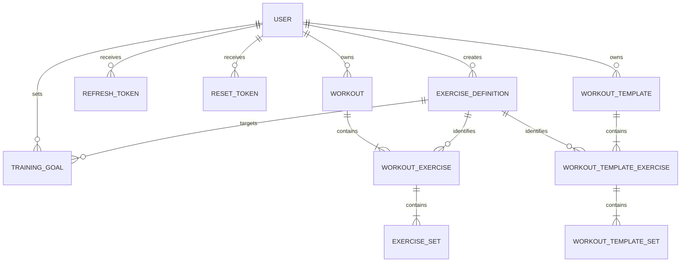

# Fitness Tracker API

[](https://github.com/cosmiinn75/fitness-tracker-api/actions/workflows/ci.yml)

A secure REST API for recording strength-training workouts and tracking long-term progress, built with **Java 25**, **Spring Boot 4.1**, **MySQL 8**, and **Redis 8**.

The project is implemented as a modular monolith with a layered architecture and goes beyond basic CRUD operations. It includes JWT authentication with refresh-token rotation, a password-reset flow, Redis-backed Token Bucket rate limiting, Redis caching for exercise-definition reads, global system exercises and user-owned custom exercises, nested workout management, reusable workout templates, progress analytics, paginated personal records powered by a native SQL window function, and a complete training-goal lifecycle with automatic completion and expiration.

The backend foundation also includes centralized authenticated-user access, dedicated DTO mapper components, standardized API errors using Spring's `ProblemDetail`, transaction-aware asynchronous email delivery through Spring application events, Flyway database migrations, automated tests, Docker, health monitoring, and continuous integration.

## Documentation

Detailed project documentation is available in the following guides:

- [Architecture and domain model](docs/architecture.md)
- [Authentication and security](docs/security.md)
- [Testing and continuous integration](docs/testing.md)

## Table of Contents

- [Highlights](#highlights)
- [Recent Backend Foundation Refactor](#recent-backend-foundation-refactor)
- [Features](#features)
- [Tech Stack](#tech-stack)
- [Architecture](#architecture)
- [Domain Model](#domain-model)
- [Database Migrations](#database-migrations)
- [API Endpoints](#api-endpoints)
- [Authentication Flow](#authentication-flow)
- [Redis Caching](#redis-caching)
- [Redis Rate Limiting](#redis-rate-limiting)
- [Transactional Async Email Delivery](#transactional-async-email-delivery)
- [Progress Analytics](#progress-analytics)
- [Training Goal Lifecycle](#training-goal-lifecycle)
- [Workout Template Workflow](#workout-template-workflow)
- [Request and Response Examples](#request-and-response-examples)
- [Validation and Error Handling](#validation-and-error-handling)
- [Running with Docker](#running-with-docker)
- [Running Locally](#running-locally)
- [Environment Variables](#environment-variables)
- [Swagger and Health Check](#swagger-and-health-check)
- [Testing](#testing)
- [Continuous Integration](#continuous-integration)
- [Project Structure](#project-structure)
- [Security](#security)
- [Roadmap](#roadmap)
- [What I Learned](#what-i-learned)
- [Status](#status)
- [Author](#author)

## Highlights

- Secure JWT authentication with access and refresh tokens
- Persistent refresh-token rotation and revocation
- Password-reset tokens stored as SHA-256 hashes with refresh-token revocation after reset
- Redis-backed Token Bucket rate limiting for public authentication routes and authenticated API traffic
- Complete nested CRUD for workouts, exercises, and sets
- Global `SYSTEM` exercises combined with user-owned `CUSTOM` exercises
- Redis-backed exercise-definition caching with targeted invalidation and a 30-minute TTL
- Reusable workout templates with ordered exercises and target sets
- Read-only workout-draft generation from saved templates
- Ownership protection for every user-specific operation
- Centralized authenticated-user access through `CurrentUserProvider`
- Dedicated mapper components for entity-to-DTO transformations
- Standardized API errors using Spring `ProblemDetail`
- Pagination, filtering, date ranges, and deterministic ordering
- Paginated personal records selected with `ROW_NUMBER()` and `PARTITION BY`
- User-owned training goals with automatic completion, cancellation, and expiration
- Flyway-managed schema with Hibernate validation
- Transaction-aware asynchronous password-reset and password-change emails through Spring application events
- Automated unit, controller, repository, and integration tests
- Dockerized API, MySQL, Redis, and Mailpit environment
- Swagger/OpenAPI documentation with JWT authorization
- Actuator health monitoring
- GitHub Actions CI with Testcontainers-backed MySQL and Redis integration tests

## Recent Backend Foundation Refactor

The project recently received an architectural refactor focused on maintainability, separation of responsibilities, consistency, and testability.

### Centralized Authenticated-User Access

Services no longer access `SecurityContextHolder` directly.

Authentication access is now abstracted behind:

```java
public interface CurrentUserProvider {
    String getCurrentUsername();
}
```

The production implementation reads the authenticated principal from Spring Security, while unit tests mock the interface directly.

This provides:

- Less duplicated security-context code
- Easier unit testing
- Clearer service dependencies
- Reduced coupling between business logic and Spring Security internals
- One consistent way of resolving the current username

### Dedicated Mapper Components

DTO construction has been extracted from services into dedicated mapper classes:

- `ExerciseDefinitionMapper`
- `WorkoutMapper`
- `ProgressMapper`
- `TrainingGoalMapper`
- `WorkoutTemplateMapper`

The mappers are responsible for transforming entities and query results into API response DTOs.

Services remain responsible for:

- Business rules
- Ownership validation
- Repository access
- Transaction boundaries
- Creating and modifying entities
- Deciding when data should be persisted

Mappers do not perform repository queries or persistence operations.

This separation keeps service classes smaller and makes response mapping independently testable.

### Standardized Problem Responses

Business and validation errors are handled through a global exception handler using Spring's `ProblemDetail`.

Error responses now have a consistent structure containing information such as:

- HTTP status
- Human-readable title
- Detailed explanation
- Stable machine-readable error code
- Problem type
- Request path
- Field-level validation errors when applicable

Example:

```json
{
  "type": "urn:problem:workout-not-found",
  "title": "Workout not found",
  "status": 404,
  "detail": "Workout not found",
  "instance": "/api/workouts/10",
  "code": "WORKOUT_NOT_FOUND"
}
```

### Updated Service Tests

Service tests were updated for the mapper-based architecture.

Repositories, external services, and `CurrentUserProvider` remain Mockito mocks, while simple mapper implementations are injected as Mockito spies:

```java
@Spy
private WorkoutMapper workoutMapper = new WorkoutMapper();

@InjectMocks
private WorkoutService workoutService;
```

This allows tests to:

- Preserve constructor injection through `@InjectMocks`
- Use real mapping behavior
- Avoid duplicating mapper expectations in every service test
- Verify complete response DTOs
- Keep unit tests independent from the Spring application context

Integration tests also reload persisted entity relationships when necessary, ensuring that API responses are produced from the same database state that would be used in a real request.


### Redis-Backed Exercise Cache

Read-heavy exercise-definition queries are cached through Spring Cache with Redis as the backing store.

The cache layer currently uses two cache regions:

- `exerciseDefinitions` — the accessible exercise list keyed by username.
- `exerciseDefinition` — one accessible exercise keyed by `username:id`.

Redis cache entries use a **30-minute TTL**.

Mutation operations invalidate only the cache entries that can become stale:

- Creating a custom exercise evicts the user's cached exercise list.
- Updating a custom exercise evicts both the user's cached list and the cached single exercise.
- Archiving a custom exercise evicts both the list and single-item cache entry.

This keeps MySQL as the source of truth while reducing repeated reads for exercise data that changes relatively infrequently.

### Redis Token-Bucket Rate Limiting

Rate limiting is implemented with Redis and an atomic Lua Token Bucket script.

Two filters are used:

```text
Public authentication RateLimitFilter
→ JWTFilter
→ AuthenticatedRateLimitFilter
→ Controller
```

The public filter runs before JWT processing and protects selected authentication endpoints by **client IP**. The authenticated filter runs after JWT validation and applies a shared API budget by **authenticated username**.

The current policies are:

| Scope | Capacity | Refill |
| --- | ---: | --- |
| `POST /api/auth/login` | 5 | 1 token every 2 seconds |
| `POST /api/auth/register` | 3 | 1 token every 30 seconds |
| `POST /api/auth/forgot-password` | 3 | 1 token every 60 seconds |
| `POST /api/auth/refresh` | 10 | 1 token every second |
| Authenticated API | 100 | 10 tokens per second |

The Lua script performs bucket reads, elapsed-time refill calculation, token consumption, state persistence, and TTL refresh atomically inside Redis. Refill is lazy and proportional to elapsed time, so no scheduled refill task is required.

Requests without an available token receive `429 Too Many Requests`.

### Transaction-Aware Async Email Events

Password-related email delivery is decoupled from the transactional service logic through Spring application events.

`ResetTokenService` publishes:

- `PasswordResetRequestedEvent` after creating a password-reset token.
- `PasswordChangedEvent` after successfully changing a password.

`EmailEventListener` handles both events with:

```java
@Async
@TransactionalEventListener(
        phase = TransactionPhase.AFTER_COMMIT
)
```

This gives the email flow two important properties:

- SMTP work runs asynchronously instead of blocking the transactional service method.
- Email is sent only after the surrounding database transaction commits successfully.

If a transaction rolls back, the transactional listener is not executed and the email is not sent. This prevents users from receiving reset or confirmation messages for database changes that were never committed.


## Features

### Authentication and Security

- Register and authenticate users
- Generate short-lived JWT access tokens
- Persist refresh tokens in MySQL
- Rotate refresh tokens when a new access token is requested
- Revoke refresh tokens during rotation and logout
- Support forgotten-password recovery with hashed reset tokens
- Revoke all refresh tokens after a successful password reset
- Send password-reset and password-change emails asynchronously after transaction commit
- Hash passwords with BCrypt
- Use stateless Spring Security configuration
- Validate access tokens through a custom JWT filter
- Rate-limit selected public authentication endpoints by client IP
- Rate-limit authenticated API traffic by authenticated username
- Execute Token Bucket updates atomically through a Redis Lua script
- Load database credentials and JWT secrets from environment variables
- Restrict workouts, templates, goals, and progress data to their authenticated owner
- Resolve the authenticated username through an injectable `CurrentUserProvider`
- Return consistent authentication and authorization errors through `ProblemDetail`

### Exercise Definitions

- Provide global `SYSTEM` exercise definitions available to every authenticated user
- Allow each user to create private `CUSTOM` exercise definitions
- Retrieve all accessible, non-archived exercises
- Combine global system exercises with the authenticated user's custom exercises
- Retrieve one exercise only when it is globally available or owned by the authenticated user
- Update only custom exercises owned by the authenticated user
- Archive custom exercises without deleting historical workout data
- Prevent users from modifying or archiving global system exercises
- Prevent duplicate custom names for the same user
- Prevent custom names that conflict with a system exercise
- Normalize names by trimming whitespace and collapsing repeated spaces
- Compare normalized names case-insensitively
- Return exercise type and archive status in API responses
- Cache exercise lists and single-exercise reads in Redis
- Evict affected Redis cache entries after create, update, and archive operations
- Map exercise entities through a dedicated mapper
- Supported muscle groups:
  - `CHEST`
  - `BACK`
  - `ARMS`
  - `SHOULDERS`
  - `LEGS`
  - `CORE`

### Workout Management

- Create workouts containing multiple exercises and sets
- Retrieve a workout by ID
- Retrieve paginated workout history
- Filter workouts by partial name and date range
- Sort workout history by date in descending order
- Update workout metadata with `PATCH`
- Require at least one supplied field when partially updating metadata
- Replace an entire workout with `PUT`
- Delete workouts
- Duplicate a workout with all exercises and sets
- Select a new name and date when duplicating a workout
- Preserve the original workout during duplication
- Protect every operation with authenticated-user ownership checks
- Map nested workouts through a dedicated `WorkoutMapper`

### Exercises and Sets Inside a Workout

- Add an exercise and its sets to an existing workout
- Change the exercise definition while preserving recorded sets
- Delete an exercise from a workout
- Add a set to an exercise
- Partially update a set
- Delete a set
- Preserve ordering through `exerciseNumber` and `setNumber`
- Automatically renumber exercises and sets after deletion
- Maintain both sides of bidirectional JPA relationships
- Return ordered nested response DTOs through the workout mapper

### Progress Analytics

- Calculate the total volume of one workout
- Calculate volume for the last seven days
- Calculate volume from the beginning of the current month
- Retrieve the personal record for one exercise
- Retrieve all personal records with database-level pagination
- Select one best set per exercise through a native MySQL window-function query
- Retrieve paginated exercise history with optional date filters
- Calculate an estimated one-repetition maximum for each history entry
- Retrieve an activity summary for the authenticated user
- Separate calculations and business rules from DTO mapping
- Map progress results through a dedicated `ProgressMapper`

### Training Goals

- Create a goal for a specific exercise
- Store target weight, repetitions, and target date
- Allow only one `ACTIVE` goal per user and exercise
- Retrieve the authenticated user's goals with pagination
- Use deterministic result ordering
- Cancel an active goal manually
- Complete goals automatically when one workout set reaches both target values
- Prevent different sets from combining their values to complete one goal
- Ignore workouts belonging to other users
- Ignore workouts recorded before the goal was created
- Complete multiple goals for different exercises through the same workout
- Return the number of goals completed by a newly created workout
- Expire overdue active goals through a scheduled database update
- Keep `GET` requests read-only
- Map training-goal responses through a dedicated mapper
- Support the following lifecycle statuses:
  - `ACTIVE`
  - `COMPLETED`
  - `CANCELLED`
  - `EXPIRED`

### Workout Templates

- Create reusable workout templates containing ordered exercises and target sets
- Store target weight, repetitions, and optional RIR
- Generate `exerciseNumber` and `setNumber` from request order
- Prevent the same exercise from appearing more than once in one template
- Prevent duplicate template names for the same user through normalized-name checks
- Reference global system exercises
- Reference custom exercises owned by the authenticated user
- Retrieve one owned template with exercises and sets in deterministic order
- Retrieve the authenticated user's templates with pagination
- Delete an owned template together with its nested data
- Preserve referenced exercise definitions when a template is deleted
- Convert a template into a pre-filled `WorkoutRequest`
- Use the current date for generated workout drafts
- Return the generated workout as an editable draft
- Avoid persisting a workout while generating a draft
- Protect every operation with authenticated-user ownership checks
- Map template aggregates through a dedicated `WorkoutTemplateMapper`

### Validation and Error Handling

- Validate request bodies with Jakarta Bean Validation
- Validate positive IDs and pagination values
- Validate date ranges
- Validate nested workout and template structures
- Reject empty exercise and set collections
- Require at least one field in partial-update requests
- Translate validation errors into field-level problem details
- Translate domain exceptions into stable error codes
- Return consistent response bodies across controllers
- Keep exception-to-HTTP-status translation in one global handler

### Database and Operations

- Manage the schema with versioned Flyway migrations
- Run Flyway before Hibernate starts
- Validate entity-to-schema compatibility with `ddl-auto=validate`
- Document the API through Springdoc OpenAPI and Swagger UI
- Authorize Swagger requests with JWT bearer tokens
- Expose a public Actuator health endpoint
- Build the API through a multi-stage Docker image
- Start the API, MySQL, Redis, and Mailpit together through Docker Compose
- Build and test pushes and pull requests through GitHub Actions
- Use Redis for exercise caching and rate-limit state
- Use Spring application events for transaction-aware asynchronous email delivery
- Run scheduled training-goal expiration at midnight
- Update overdue goals with one transactional JPQL bulk query
- Persist workout templates through a dedicated Flyway migration
- Use cascade deletion for nested workout-template data

## Tech Stack

| Area | Technology |
| --- | --- |
| Language | Java 25 |
| Framework | Spring Boot 4.1.0 |
| Web | Spring Web MVC |
| Security | Spring Security, JWT, BCrypt |
| Rate limiting | Redis 8, Token Bucket, Lua |
| Caching | Spring Cache, Redis 8 |
| Persistence | Spring Data JPA, Hibernate |
| Database | MySQL 8 |
| Schema migrations | Flyway |
| Validation | Jakarta Bean Validation |
| Async/eventing | Spring Application Events, `@TransactionalEventListener`, `@Async` |
| Email | Spring Mail, Mailpit for local/Docker development |
| Error responses | Spring `ProblemDetail` |
| API documentation | Springdoc OpenAPI, Swagger UI |
| Monitoring | Spring Boot Actuator |
| Scheduling | Spring `@Scheduled` |
| Testing | JUnit 5, Mockito, MockMvc, Spring Boot Test, Testcontainers, Awaitility |
| Build | Maven Wrapper |
| Containers | Docker, Docker Compose |
| CI | GitHub Actions |

## Architecture

The application is designed as a modular monolith with a layered architecture.

### Controllers

Controllers:

- Expose REST endpoints
- Validate request bodies and parameters
- Delegate business operations to services
- Return response DTOs and appropriate HTTP statuses

### Services

Services:

- Implement business rules
- Validate resource ownership
- Coordinate repositories
- Create and update entities
- Manage transactional operations
- Decide when data should be persisted
- Use `CurrentUserProvider` instead of accessing the security context directly

### Mappers

Dedicated mappers:

- Transform entities into response DTOs
- Transform nested aggregates into ordered API responses
- Map repository projections into response models
- Convert workout templates into workout drafts
- Keep DTO-construction logic outside service classes

Mappers do not:

- Query repositories
- Save entities
- Access the authenticated user
- Make ownership decisions
- Replace service-layer business rules

### Repositories

Repositories:

- Access MySQL through Spring Data JPA
- Use derived queries for standard operations
- Use JPQL for aggregate updates
- Use native SQL for optimized ranking queries
- Return projections where loading complete entity graphs is unnecessary

### DTOs

DTOs:

- Separate the public API contract from persistence entities
- Define request validation rules
- Prevent JPA entities from being exposed directly
- Represent nested request and response structures

### Projections

Interface projections:

- Map optimized native-query results
- Avoid loading full entity graphs
- Support paginated personal-record results

### Security Components

Security components:

- Validate JWT access tokens
- Populate the Spring Security context
- Resolve the current principal through `CurrentUserProvider`
- Keep authentication details separate from business logic

### Redis Cache Layer

`ExerciseDefinitionCacheService` isolates Redis-backed cache behavior from the main exercise-definition business service.

It:

- Uses `@Cacheable` for list and single-item reads.
- Uses username-aware cache keys to preserve user isolation.
- Uses `@CacheEvict` / `@Caching` for targeted invalidation.
- Keeps cache concerns outside the repository layer.
- Treats MySQL as the authoritative data source.

### Rate-Limit Components

Rate limiting is separated into:

- `RateLimitFilter` for selected public authentication endpoints.
- `JWTFilter` for access-token validation.
- `AuthenticatedRateLimitFilter` for authenticated API traffic.
- `RateLimitService` for executing the Redis Lua script.
- `RateLimitPolicy` / `RateLimitRule` for reusable policy configuration.

The Redis Lua script atomically reads and updates the Token Bucket state, preventing concurrent requests from overspending the same bucket.

### Async Email Event Flow

Password services publish application events instead of calling the mail sender directly.

```text
Transactional password service
→ ApplicationEventPublisher
→ transaction commits
→ @TransactionalEventListener(AFTER_COMMIT)
→ @Async
→ EmailService
→ SMTP
```

This separates database consistency from email I/O while ensuring that emails are not sent for rolled-back operations.

### Exception Handling

The global exception handler:

- Converts business exceptions into `ProblemDetail`
- Assigns HTTP statuses
- Provides stable problem types and error codes
- Returns field-level validation errors
- Ensures a consistent API error contract

### Flyway Migrations

Flyway migrations:

- Version the database schema
- Reproduce the same schema in local, Docker, test, and CI environments
- Run before Hibernate validation

### Scheduled Components

Scheduled components:

- Expire overdue active training goals
- Perform the update through one transactional database query
- Avoid performing state changes during read endpoints

## Domain Model


```mermaid
erDiagram
    USER ||--o{ WORKOUT : owns
    USER ||--o{ REFRESH_TOKEN : receives
    USER ||--o{ RESET_TOKEN : receives
    USER ||--o{ TRAINING_GOAL : sets
    USER ||--o{ WORKOUT_TEMPLATE : owns
    USER ||--o{ EXERCISE_DEFINITION : creates

    WORKOUT ||--|{ WORKOUT_EXERCISE : contains
    WORKOUT_EXERCISE ||--|{ EXERCISE_SET : contains

    EXERCISE_DEFINITION ||--o{ WORKOUT_EXERCISE : identifies
    EXERCISE_DEFINITION ||--o{ TRAINING_GOAL : targets
    EXERCISE_DEFINITION ||--o{ WORKOUT_TEMPLATE_EXERCISE : identifies

    WORKOUT_TEMPLATE ||--|{ WORKOUT_TEMPLATE_EXERCISE : contains
    WORKOUT_TEMPLATE_EXERCISE ||--|{ WORKOUT_TEMPLATE_SET : contains
```

- A user owns multiple workouts, refresh tokens, reset tokens, training goals, custom exercises, and workout templates.
- A system exercise is globally accessible and has no user owner.
- A custom exercise belongs to exactly one user.
- A workout contains ordered workout exercises.
- A workout exercise references one reusable exercise definition.
- A workout exercise contains ordered sets.
- A set records weight, repetitions, and optional repetitions in reserve.
- A training goal links one user to one exercise definition.
- A training goal stores target values, dates, and lifecycle status.
- A workout template stores an ordered reusable training structure.
- A template can be converted into an editable workout draft without creating workout history.

## Database Migrations

The schema is managed by Flyway instead of being generated automatically by Hibernate.

Migration files are stored in:

```text
src/main/resources/db/migration
```

Flyway migrations use the following naming convention:

```text
V<version>__<description>.sql
```

The migration history includes:

- Initial user and authentication schema
- Workout, exercise, and set tables
- Database indexes
- Training-goal tables and lifecycle status
- Password-reset tokens
- Exercise ownership and exercise types
- Workout-template tables and nested relationships

Main tables include:

- `users`
- `refresh_tokens`
- `reset_tokens`
- `exercise_definitions`
- `workouts`
- `workout_exercises`
- `exercise_sets`
- `training_goals`
- `workout_templates`
- `workout_template_exercises`
- `workout_template_sets`

The `training_goals` table includes:

- A foreign key to `users`
- A foreign key to `exercise_definitions`
- Target weight
- Target repetitions
- Creation date
- Target date
- Lifecycle status
- Supporting indexes for user-, exercise-, and status-based queries

The exercise-definition schema distinguishes global `SYSTEM` exercises from user-owned `CUSTOM` exercises.

The workout-template schema:

- Preserves exercise ordering
- Preserves set ordering
- Cascades nested template deletion
- Prevents referenced exercise definitions from being deleted accidentally

Application startup follows this sequence:

1. The application connects to MySQL.
2. Flyway reads `flyway_schema_history`.
3. Flyway applies migrations that have not yet run.
4. Hibernate validates the resulting schema.
5. The application starts only when entity mappings match the schema.

Applied migrations must not be edited. Every future schema modification should be introduced through a new versioned migration.

## API Endpoints

All endpoints except authentication, Swagger/OpenAPI, and the Actuator health endpoint require a valid JWT access token.

Protected requests use:

```http
Authorization: Bearer <access-token>
```

### Authentication

| Method | Endpoint | Description |
| --- | --- | --- |
| `POST` | `/api/auth/register` | Register a user and return an access/refresh-token pair |
| `POST` | `/api/auth/login` | Authenticate and return an access/refresh-token pair |
| `POST` | `/api/auth/refresh` | Rotate a refresh token and return a new token pair |
| `POST` | `/api/auth/logout` | Revoke a refresh token |
| `POST` | `/api/auth/forgot-password` | Request a password-reset email without revealing whether the account exists |
| `POST` | `/api/auth/reset-password` | Reset the password with a valid raw reset token |

### Exercise Definitions

| Method | Endpoint | Description |
| --- | --- | --- |
| `GET` | `/api/exercises` | Retrieve accessible system and custom exercises |
| `GET` | `/api/exercises/{id}` | Retrieve one accessible exercise |
| `POST` | `/api/exercises` | Create a user-owned custom exercise |
| `PUT` | `/api/exercises/{id}` | Replace an owned custom exercise |
| `PATCH` | `/api/exercises/{id}` | Archive an owned custom exercise |

### Workouts

| Method | Endpoint | Description |
| --- | --- | --- |
| `GET` | `/api/workouts` | Retrieve paginated and filtered workouts |
| `GET` | `/api/workouts/{id}` | Retrieve one workout |
| `POST` | `/api/workouts` | Create a workout with exercises and sets |
| `PATCH` | `/api/workouts/{id}` | Update workout name and/or date |
| `PUT` | `/api/workouts/{id}` | Replace the complete workout |
| `DELETE` | `/api/workouts/{id}` | Delete a workout |
| `POST` | `/api/workouts/{workoutId}/duplicate` | Duplicate a workout with a new name and date |

`GET /api/workouts` supports:

| Parameter | Default | Rules | Description |
| --- | --- | --- | --- |
| `page` | `0` | Minimum `0` | Zero-based page index |
| `size` | `10` | From `1` to `100` | Page size |
| `name` | — | Optional | Case-insensitive partial-name filter |
| `startDate` | — | `YYYY-MM-DD` | Inclusive start date |
| `endDate` | — | `YYYY-MM-DD` | Inclusive end date |

Example:

```http
GET /api/workouts?page=0&size=10&name=push&startDate=2026-07-01&endDate=2026-07-31
```

### Workout Exercises and Sets

| Method | Endpoint | Description |
| --- | --- | --- |
| `POST` | `/api/workouts/{workoutId}/exercises` | Add an exercise and its sets |
| `PATCH` | `/api/workouts/{workoutId}/exercises/{exerciseNumber}` | Change the exercise definition |
| `DELETE` | `/api/workouts/{workoutId}/exercises/{exerciseNumber}` | Delete and renumber an exercise |
| `POST` | `/api/workouts/{workoutId}/exercises/{exerciseNumber}/sets` | Add a set |
| `PATCH` | `/api/workouts/{workoutId}/exercises/{exerciseNumber}/sets/{setNumber}` | Partially update a set |
| `DELETE` | `/api/workouts/{workoutId}/exercises/{exerciseNumber}/sets/{setNumber}` | Delete and renumber a set |

### Progress

| Method | Endpoint | Description |
| --- | --- | --- |
| `GET` | `/api/progress/workouts/{workoutId}/volume` | Calculate one workout's volume |
| `GET` | `/api/progress/weekly-volume` | Calculate volume for the last seven days |
| `GET` | `/api/progress/monthly-volume` | Calculate volume from the start of the current month |
| `GET` | `/api/progress/exercises/{exerciseDefinitionId}/personal-record` | Retrieve the best set for one exercise |
| `GET` | `/api/progress/personal-records` | Retrieve paginated personal records |
| `GET` | `/api/progress/exercises/{exerciseDefinitionId}/history` | Retrieve paginated exercise history |
| `GET` | `/api/progress/summary` | Retrieve an activity summary |

Personal-record pagination:

| Parameter | Default | Rules |
| --- | --- | --- |
| `page` | `0` | Minimum `0` |
| `size` | `20` | From `1` to `100` |

Exercise history accepts the same pagination parameters plus optional date filters:

```http
GET /api/progress/exercises/1/history?page=0&size=20&startDate=2026-06-01&endDate=2026-07-31
```

### Training Goals

| Method | Endpoint | Description |
| --- | --- | --- |
| `POST` | `/api/training-goals` | Create a training goal |
| `GET` | `/api/training-goals` | Retrieve the authenticated user's goals |
| `PATCH` | `/api/training-goals/{id}/cancel` | Cancel an active training goal |

Example:

```http
GET /api/training-goals?page=0&size=10
```

Training goals are always restricted to the authenticated owner. An ID belonging to a different user is treated as a missing resource.

### Workout Templates

| Method | Endpoint | Description |
| --- | --- | --- |
| `POST` | `/api/workout-templates` | Create a reusable workout template |
| `GET` | `/api/workout-templates` | Retrieve owned templates with pagination |
| `GET` | `/api/workout-templates/{templateId}` | Retrieve one owned template |
| `GET` | `/api/workout-templates/{templateId}/workout-draft` | Generate an unsaved editable workout draft |
| `DELETE` | `/api/workout-templates/{templateId}` | Delete an owned template and its nested data |

Pagination defaults:

| Parameter | Default | Rules |
| --- | --- | --- |
| `page` | `0` | Minimum `0` |
| `size` | `20` | From `1` to `100` |

### Operations

| Method | Endpoint | Authentication | Description |
| --- | --- | --- | --- |
| `GET` | `/actuator/health` | Public | Return application health information |

## Authentication Flow

1. A user registers or logs in.
2. The public Redis rate-limit filter applies the configured IP-based Token Bucket policy.
3. The API validates the supplied credentials.
4. The API returns an access token and refresh token.
5. The client sends the access token in the `Authorization` header.
6. `JWTFilter` validates the token and establishes the authenticated principal.
7. The authenticated Redis rate-limit filter applies the per-user API bucket.
8. Access tokens expire after 15 minutes.
9. Refresh tokens are persisted in MySQL and expire after 7 days.
10. `/api/auth/refresh` is rate-limited before the refresh token is validated.
11. The current refresh token is revoked.
12. A new access and refresh-token pair is returned.
13. `/api/auth/logout` revokes the supplied refresh token.

A successfully rotated refresh token cannot be reused.

## Redis Caching

Exercise-definition reads use Spring Cache backed by Redis.

The current cache regions are:

| Cache | Key | Purpose |
| --- | --- | --- |
| `exerciseDefinitions` | `username` | Cache the authenticated user's accessible exercise list |
| `exerciseDefinition` | `username:id` | Cache one accessible exercise definition |

The configured Redis cache TTL is **30 minutes**.

Cache invalidation follows the mutation that can make data stale:

```text
create custom exercise
→ evict exerciseDefinitions::<username>

update/archive custom exercise
→ evict exerciseDefinitions::<username>
→ evict exerciseDefinition::<username>:<id>
```

The cache is an optimization only. MySQL remains the authoritative source of exercise-definition data.

The integration suite uses a real Redis Testcontainer to verify cache population, cache hits, and eviction behavior.

## Redis Rate Limiting

The API uses a Redis-backed Token Bucket implementation with lazy continuous refill.

### Public Authentication Buckets

Selected public authentication routes are limited by client IP:

| Method | Endpoint | Capacity | Refill |
| --- | --- | ---: | --- |
| `POST` | `/api/auth/login` | 5 | 1 token every 2 seconds |
| `POST` | `/api/auth/register` | 3 | 1 token every 30 seconds |
| `POST` | `/api/auth/forgot-password` | 3 | 1 token every 60 seconds |
| `POST` | `/api/auth/refresh` | 10 | 1 token every second |

### Authenticated API Bucket

Protected API traffic uses one general bucket per authenticated username:

```text
capacity = 100 tokens
refill = 10 tokens / second
```

Authentication routes, Swagger/OpenAPI, and `/actuator/health` are excluded from this authenticated-user bucket.

### Token Bucket Execution

The Redis Lua script stores:

- `tokens`
- `last_refill`

For every request it atomically:

1. Reads the current bucket state.
2. Uses Redis server time.
3. Calculates the elapsed time since the previous request.
4. Refills fractional tokens proportionally to elapsed time.
5. Caps the balance at the configured capacity.
6. Consumes one token when available.
7. Persists the new bucket state.
8. Refreshes the Redis key TTL.

Because refill is calculated when requests arrive, the implementation does not require a scheduled refill job.

When the bucket cannot provide a token, the API returns:

```http
HTTP/1.1 429 Too Many Requests
```

The filter order is:

```text
RateLimitFilter
→ JWTFilter
→ AuthenticatedRateLimitFilter
→ Controller
```

The public limiter uses the remote client address. Deployments behind a reverse proxy should trust forwarded client-IP headers only from explicitly trusted proxies.

## Transactional Async Email Delivery

Password-reset email delivery uses Spring application events instead of performing SMTP work directly inside the password service.

The current event flow is:

```text
ResetTokenService
→ publish PasswordResetRequestedEvent / PasswordChangedEvent
→ database transaction commits
→ EmailEventListener
→ @Async
→ EmailService
→ SMTP
```

`EmailEventListener` combines `@Async` with:

```java
@TransactionalEventListener(
        phase = TransactionPhase.AFTER_COMMIT
)
```

This means:

- The service transaction is not blocked by SMTP delivery.
- The listener runs only after a successful database commit.
- A rollback prevents the email from being sent.
- Password-reset token creation and outgoing email stay consistent.

For a forgotten-password request, only the SHA-256 hash of the reset token is stored in MySQL. The raw token exists only long enough to be included in the `PasswordResetRequestedEvent` and sent to the user.

After a successful reset:

- The new password is stored as a BCrypt hash.
- All refresh tokens for the user are revoked.
- Reset tokens are deleted.
- A `PasswordChangedEvent` triggers the confirmation email after commit.

Integration tests explicitly verify both behaviors:

```text
transaction commits   → email service is called asynchronously
transaction rolls back → email service is not called
```

## Progress Analytics

### Workout Volume

Volume is calculated for every set and then summed:

```text
volume = weight × repetitions
```

### Personal Records

The best recorded set is selected in this order:

1. Highest weight
2. Highest repetitions when weight is equal
3. Highest RIR when weight and repetitions are equal
4. Most recent workout date
5. Deterministic workout and set ordering for remaining ties

The paginated endpoint performs this selection directly in MySQL:

```sql
ROW_NUMBER() OVER (
    PARTITION BY exercise_definition_id
    ORDER BY weight DESC, reps DESC, rir DESC, date DESC
)
```

Only one result per exercise is returned.

The query:

- Filters by the authenticated username
- Uses an interface projection
- Uses a dedicated `countQuery`
- Supports database-level pagination
- Avoids loading unnecessary entity graphs

### Estimated One-Repetition Maximum

Exercise history includes the highest estimated 1RM from each workout entry.

The Epley formula is used:

```text
estimated 1RM = weight × (1 + repetitions / 30)
```

The value is intended for tracking progress and is not guaranteed to represent a user's exact maximal lift.

### Progress Summary

`GET /api/progress/summary` returns:

- Total workout count
- Distinct training days during the last 7 days
- Distinct training days during the last 30 days
- Total sets recorded during the last 7 days
- Date of the latest workout
- Most-trained exercise during the last 30 days

The most-trained exercise is measured by recorded set count.

## Training Goal Lifecycle

A training goal starts with `ACTIVE` status and can reach one terminal status:

- `COMPLETED`
- `CANCELLED`
- `EXPIRED`

A goal becomes `COMPLETED` when one workout set reaches both:

- The target weight
- The target repetition count

Values from different sets are not combined.

A goal becomes `CANCELLED` when its authenticated owner cancels it manually.

A goal becomes `EXPIRED` after its target date passes.

A goal remains active throughout its target date. Only goals whose `targetDate` is earlier than the current date are expired.

Overdue goals are updated at midnight by a scheduled component. The scheduler uses a transactional JPQL bulk update, allowing all matching active goals to be updated through one database statement.

Workout creation checks active goals after the workout aggregate has been assembled.

A goal is completed only when:

1. The goal belongs to the workout owner.
2. The workout contains the targeted exercise.
3. The workout was recorded after the goal was created.
4. One set reaches both target values.
5. The target date has not passed.

The create-workout response reports the number of completed goals through:

```json
{
  "goalsCompleted": 1
}
```

## Workout Template Workflow

A workout template stores a reusable training structure independently from workout history.

The workflow is:

1. The authenticated user creates a template.
2. The template contains ordered exercises.
3. Every exercise contains ordered target sets.
4. Referenced exercises must be accessible to the user.
5. The same exercise cannot appear twice in one template.
6. The template is saved without creating a workout.
7. The user requests a workout draft from the template.
8. The API converts template target values into a `WorkoutRequest`.
9. The generated draft uses the current date.
10. The client may edit the draft.
11. The client sends the final request to `POST /api/workouts`.
12. Only that final request persists workout history.

Generating a draft:

- Is read-only
- Does not modify the template
- Does not save a workout
- Does not create exercise sets in workout history

## Request and Response Examples

### Register

```http
POST /api/auth/register
Content-Type: application/json
```

```json
{
  "username": "cosmin",
  "email": "cosmin@example.com",
  "password": "strongPassword123"
}
```

Example response:

```json
{
  "accessToken": "<jwt-access-token>",
  "refreshToken": "<refresh-token>"
}
```

### Create a Custom Exercise

```http
POST /api/exercises
Authorization: Bearer <access-token>
Content-Type: application/json
```

```json
{
  "exerciseName": "Chest-Supported Row",
  "muscleGroup": "BACK"
}
```

Example response:

```json
{
  "id": 21,
  "exerciseName": "Chest-Supported Row",
  "muscleGroup": "BACK",
  "exerciseType": "CUSTOM",
  "archived": false
}
```

Every exercise created through this endpoint:

- Receives the `CUSTOM` type
- Belongs to the authenticated user
- Is not accessible to other users

Global system exercises remain read-only.

### Create a Workout

```http
POST /api/workouts
Authorization: Bearer <access-token>
Content-Type: application/json
```

```json
{
  "workoutName": "Push Day",
  "date": "2026-07-22",
  "exerciseRequests": [
    {
      "exerciseDefinitionId": 1,
      "setRequests": [
        {
          "weight": 80.0,
          "reps": 8,
          "rir": 2
        },
        {
          "weight": 100.0,
          "reps": 5,
          "rir": 1
        }
      ]
    }
  ]
}
```

Example response:

```json
{
  "id": 10,
  "workoutName": "Push Day",
  "date": "2026-07-22",
  "exerciseResponses": [
    {
      "id": 31,
      "exerciseNumber": 1,
      "exerciseName": "Bench Press",
      "setResponses": [
        {
          "id": 91,
          "setNumber": 1,
          "weight": 80.0,
          "reps": 8,
          "rir": 2
        },
        {
          "id": 92,
          "setNumber": 2,
          "weight": 100.0,
          "reps": 5,
          "rir": 1
        }
      ]
    }
  ],
  "goalsCompleted": 1
}
```

### Partially Update Workout Metadata

At least one field must be supplied.

```http
PATCH /api/workouts/10
Authorization: Bearer <access-token>
Content-Type: application/json
```

```json
{
  "workoutName": "Updated Push Day"
}
```

The following request is rejected:

```json
{}
```

because it does not provide a name or date.

### Partially Update a Set

Only supplied fields are changed.

```http
PATCH /api/workouts/10/exercises/1/sets/2
Authorization: Bearer <access-token>
Content-Type: application/json
```

```json
{
  "reps": 9,
  "rir": 0
}
```

### Duplicate a Workout

```http
POST /api/workouts/10/duplicate
Authorization: Bearer <access-token>
Content-Type: application/json
```

```json
{
  "workoutName": "Push Day - Week 2",
  "date": "2026-07-29"
}
```

The original workout remains unchanged.

### Create a Training Goal

```http
POST /api/training-goals
Authorization: Bearer <access-token>
Content-Type: application/json
```

```json
{
  "exerciseDefinitionId": 1,
  "targetWeight": 110.0,
  "targetReps": 5,
  "targetDate": "2026-09-30"
}
```

Example response:

```json
{
  "id": 1,
  "exerciseName": "Bench Press",
  "targetWeight": 110.0,
  "targetReps": 5,
  "targetDate": "2026-09-30",
  "status": "ACTIVE"
}
```

### Retrieve Training Goals

```http
GET /api/training-goals?page=0&size=10
Authorization: Bearer <access-token>
```

```json
{
  "content": [
    {
      "id": 1,
      "exerciseName": "Bench Press",
      "targetWeight": 110.0,
      "targetReps": 5,
      "targetDate": "2026-09-30",
      "status": "ACTIVE"
    }
  ],
  "page": 0,
  "size": 10,
  "totalElements": 1,
  "totalPages": 1,
  "first": true,
  "last": true
}
```

### Cancel a Training Goal

```http
PATCH /api/training-goals/1/cancel
Authorization: Bearer <access-token>
```

Only an active goal can be cancelled.

### Create a Workout Template

```http
POST /api/workout-templates
Authorization: Bearer <access-token>
Content-Type: application/json
```

```json
{
  "workoutTemplateName": "Push Day",
  "templateExerciseRequest": [
    {
      "exerciseDefinitionId": 1,
      "templateSetRequests": [
        {
          "targetWeight": 100.0,
          "targetReps": 5,
          "targetRir": 2
        },
        {
          "targetWeight": 90.0,
          "targetReps": 8,
          "targetRir": 2
        }
      ]
    }
  ]
}
```

Exercise and set numbers are assigned according to request order.

### Prepare a Workout Draft

```http
GET /api/workout-templates/1/workout-draft
Authorization: Bearer <access-token>
```

Example response:

```json
{
  "workoutName": "Push Day",
  "date": "2026-08-01",
  "exerciseRequests": [
    {
      "exerciseDefinitionId": 1,
      "setRequests": [
        {
          "weight": 100.0,
          "reps": 5,
          "rir": 2
        },
        {
          "weight": 90.0,
          "reps": 8,
          "rir": 2
        }
      ]
    }
  ]
}
```

Nothing is persisted until the client submits the draft to:

```http
POST /api/workouts
```

### Paginated Personal Records

```http
GET /api/progress/personal-records?page=0&size=2
Authorization: Bearer <access-token>
```

```json
{
  "content": [
    {
      "exerciseDefinitionId": 1,
      "exerciseName": "Bench Press",
      "weight": 105.0,
      "reps": 3,
      "rir": 0,
      "date": "2026-07-22"
    },
    {
      "exerciseDefinitionId": 2,
      "exerciseName": "Squat",
      "weight": 145.0,
      "reps": 4,
      "rir": 0,
      "date": "2026-07-22"
    }
  ],
  "page": 0,
  "size": 2,
  "totalElements": 7,
  "totalPages": 4,
  "first": true,
  "last": false
}
```

Users without recorded sets receive:

```json
{
  "content": [],
  "page": 0,
  "size": 20,
  "totalElements": 0,
  "totalPages": 0,
  "first": true,
  "last": true
}
```

### Progress Summary

```json
{
  "totalWorkouts": 42,
  "trainingDaysLast7Days": 4,
  "trainingDaysLast30Days": 15,
  "totalSetsLast7Days": 58,
  "lastWorkoutDate": "2026-07-22",
  "mostTrainedExerciseLast30Days": "Bench Press"
}
```

### Exercise History

```json
{
  "content": [
    {
      "workoutId": 10,
      "workoutExerciseId": 31,
      "exerciseNumber": 1,
      "exerciseName": "Bench Press",
      "estimatedOneRepMax": 122.5,
      "workoutDate": "2026-07-22",
      "setResponses": [
        {
          "id": 91,
          "setNumber": 1,
          "weight": 105.0,
          "reps": 5,
          "rir": 1
        }
      ]
    }
  ],
  "page": 0,
  "size": 20,
  "totalElements": 1,
  "totalPages": 1,
  "first": true,
  "last": true
}
```

## Validation and Error Handling

The API validates:

- Usernames
- Email addresses
- Passwords
- Exercise names
- Muscle groups
- Workout names
- Workout dates
- Exercise-definition IDs
- Weight values
- Repetition values
- RIR values
- Positive path variables
- Page indexes
- Page sizes
- Start and end date ordering
- Non-empty nested collections
- At least one supplied field in partial updates
- Training-goal target dates
- Positive training-goal targets
- One active goal per user and exercise
- Training-goal ownership
- Valid goal status transitions
- Exercise accessibility
- Custom-exercise ownership
- Unique normalized template names
- Valid template target values
- Duplicate exercises inside one template
- Workout-template ownership

The global exception handler uses `ProblemDetail`.

Typical status codes include:

- `400 Bad Request` for invalid input or date ranges
- `401 Unauthorized` for missing or invalid authentication
- `404 Not Found` for missing or inaccessible user-owned resources
- `409 Conflict` for duplicate resources or invalid lifecycle transitions
- `429 Too Many Requests` when a Redis Token Bucket is exhausted
- `500 Internal Server Error` for unexpected server failures

Example not-found response:

```json
{
  "type": "urn:problem:workout-not-found",
  "title": "Workout not found",
  "status": 404,
  "detail": "Workout not found",
  "instance": "/api/workouts/10",
  "code": "WORKOUT_NOT_FOUND"
}
```

Example validation response:

```json
{
  "type": "urn:problem:validation-error",
  "title": "Validation failed",
  "status": 400,
  "detail": "One or more fields are invalid",
  "instance": "/api/workouts",
  "code": "VALIDATION_ERROR",
  "fieldErrors": {
    "workoutName": "Workout name must contain at least 3 characters"
  }
}
```

Stable error codes allow API clients to react to failures without depending only on human-readable messages.

## Running with Docker

### Requirements

- Docker
- Docker Compose

### Start the Application

```bash
git clone https://github.com/cosmiinn75/fitness-tracker-api.git
cd fitness-tracker-api
cp .env.example .env
```

Update `.env` with a database password and long JWT secret.

Start the stack:

```bash
docker compose up --build
```

Docker Compose:

1. Starts MySQL 8.
2. Starts Redis 8.
3. Starts Mailpit for local SMTP delivery and email inspection.
4. Waits for the MySQL health check.
5. Starts the API after MySQL, Redis, and Mailpit are available.
6. Runs Flyway migrations.
7. Validates the schema through Hibernate.

Available services:

- API: `http://localhost:8080`
- MySQL from the host: `localhost:3307`
- Redis: `localhost:6379`
- Mailpit SMTP: `localhost:1025`
- Mailpit web UI: `http://localhost:8025`
- Swagger UI: `http://localhost:8080/swagger-ui/index.html`
- Health check: `http://localhost:8080/actuator/health`

Stop the stack:

```bash
docker compose down
```

MySQL data is preserved in the named volume:

```text
fitness_tracker_mysql_data
```

Remove the containers and database volume:

```bash
docker compose down -v
```

This permanently removes the database data stored in the Docker volume.

## Running Locally

### Requirements

- Java 25
- MySQL 8
- Redis 8
- An SMTP server; Mailpit is recommended for local development

Create an empty database:

```sql
CREATE DATABASE fitness_tracker_db;
```

Flyway creates the tables when the application starts.

Create an environment file:

```bash
cp .env.example .env
```

Start the application:

```bash
./mvnw spring-boot:run
```

On Windows PowerShell:

```powershell
.\mvnw.cmd spring-boot:run
```

The API starts at:

```text
http://localhost:8080
```

## Environment Variables

| Variable | Required | Example | Description |
| --- | --- | --- | --- |
| `DB_URL` | Yes | `jdbc:mysql://localhost:3306/fitness_tracker_db` | JDBC database URL |
| `DB_USERNAME` | Yes | `root` | Database username |
| `DB_PASSWORD` | Yes | `your_local_password` | Database password |
| `JWT_SECRET` | Yes | A long random value | Secret used to sign JWT access tokens |
| `REDIS_HOST` | No | `localhost` | Redis host used for caching and rate limiting |
| `REDIS_PORT` | No | `6379` | Redis port |
| `SPRING_MAIL_HOST` | No | `localhost` | SMTP host used by `EmailService` |
| `SPRING_MAIL_PORT` | No | `1025` | SMTP port; matches Mailpit by default |
| `SPRING_JPA_HIBERNATE_DDL_AUTO` | No | `validate` | Hibernate schema strategy override |

Inside Docker, the API uses Compose service names:

```text
MySQL: jdbc:mysql://mysql:3306/fitness_tracker_db
Redis: redis:6379
SMTP:  mailpit:1025
```

Do not commit:

- `.env`
- Database passwords
- JWT secrets
- Production credentials

## Swagger and Health Check

Swagger UI:

```text
http://localhost:8080/swagger-ui/index.html
```

OpenAPI document:

```text
http://localhost:8080/v3/api-docs
```

To call protected endpoints through Swagger:

1. Register or log in.
2. Copy the access token.
3. Select **Authorize**.
4. Paste the token.
5. Call a protected endpoint.

Health endpoint:

```text
http://localhost:8080/actuator/health
```

Example:

```json
{
  "status": "UP"
}
```

## Testing

Run the complete verification lifecycle:

```bash
./mvnw clean verify
```

On Windows PowerShell:

```powershell
.\mvnw.cmd clean verify
```

Run one test class:

```powershell
.\mvnw.cmd "-Dtest=WorkoutServiceTest" test
```

The automated suite includes:

- Service unit tests with JUnit and Mockito
- Real mapper behavior injected through Mockito spies
- Controller tests with MockMvc
- Spring Boot integration tests backed by MySQL
- Redis cache integration tests backed by a real Redis Testcontainer
- Transaction-aware asynchronous email-event integration tests
- Authentication and refresh-token tests
- Ownership and access-control tests
- Validation and `ProblemDetail` response tests
- Workout duplication tests
- Exercise-history tests
- Progress-summary tests
- Native personal-record query integration tests
- Projection-mapping tests
- Pagination tests
- Training-goal lifecycle tests
- Scheduled goal-expiration tests
- Workout-template service tests
- Workout persistence and nested-response integration tests

### Service Testing Strategy

Service tests use:

```java
@Mock
private WorkoutRepository workoutRepository;

@Mock
private CurrentUserProvider currentUserProvider;

@Spy
private WorkoutMapper workoutMapper = new WorkoutMapper();

@InjectMocks
private WorkoutService workoutService;
```

This strategy keeps:

- Database access mocked
- Authentication access mocked
- Business services isolated
- Mapper transformations real
- Spring context startup unnecessary for unit tests

### Personal-Record Tests

Personal-record tests verify:

- Highest-weight priority
- Repetition priority when weights are equal
- RIR priority
- Date priority
- User isolation
- Correct page metadata
- Multiple exercises across pages
- Empty results for users without sets

### Training-Goal Tests

Training-goal tests verify:

- Successful creation
- Correct initial status
- Rejection of invalid target dates
- One active goal per user and exercise
- Creation after a previous terminal goal
- Completion when the same set reaches both targets
- No completion when targets are split across sets
- User isolation
- Workout-date validation
- Manual cancellation
- Invalid lifecycle transitions
- Scheduled expiration
- Pagination and ownership behavior

### Workout-Template Tests

Workout-template tests verify:

- Nested template creation
- Ordered exercises and sets
- Normalized duplicate-name rejection
- Duplicate-exercise rejection
- Missing or inaccessible exercise rejection
- Ownership protection
- Nested deletion behavior
- Template-to-workout-draft conversion
- No persistence during draft generation

### Integration Testing

Integration tests verify:

- Real entity persistence
- Nested JPA relationships
- Repository queries
- Controller-to-database behavior
- Serialized nested API responses
- Authentication and ownership boundaries
- Standardized error responses
- Real Redis cache population, cache-hit, and eviction behavior
- Email dispatch after transaction commit and suppression after rollback

Persistence-context cleanup is used where necessary to ensure that requests reload the same relationship state that would be loaded in production.

## Continuous Integration

The GitHub Actions workflow runs for pushes and pull requests targeting `main`.

The pipeline:

1. Checks out the repository.
2. Configures Java 25.
3. Restores the Maven dependency cache.
4. Makes Docker available to Testcontainers.
5. Starts MySQL and Redis Testcontainers when required by integration tests.
6. Runs Flyway against the MySQL test database.
7. Compiles the project.
8. Executes `./mvnw --batch-mode clean verify`.
9. Fails the build when any test fails.

The current build status is displayed through the badge at the top of this README.

## Project Structure

```text
fitness-tracker-api/
├── .github/
│   └── workflows/
│       └── ci.yml
├── src/
│   ├── main/
│   │   ├── java/com/cosmin/fitness_tracker_api/
│   │   │   ├── config/
│   │   │   │   ├── CacheConfig.java
│   │   │   │   ├── RateLimitConfig.java
│   │   │   │   └── SpringAsyncConfig.java
│   │   │   ├── controller/
│   │   │   ├── dto/
│   │   │   ├── enums/
│   │   │   ├── event/
│   │   │   │   ├── PasswordChangedEvent.java
│   │   │   │   └── PasswordResetRequestedEvent.java
│   │   │   ├── exception/
│   │   │   ├── listener/
│   │   │   │   └── EmailEventListener.java
│   │   │   ├── mapper/
│   │   │   │   ├── ExerciseDefinitionMapper.java
│   │   │   │   ├── ProgressMapper.java
│   │   │   │   ├── TrainingGoalMapper.java
│   │   │   │   ├── WorkoutMapper.java
│   │   │   │   └── WorkoutTemplateMapper.java
│   │   │   ├── model/
│   │   │   ├── repository/
│   │   │   │   └── Projection/
│   │   │   ├── security/
│   │   │   │   ├── CurrentUserProvider.java
│   │   │   │   ├── JWTFilter.java
│   │   │   │   ├── SpringSecurityCurrentUserProvider.java
│   │   │   │   └── rateLimit/
│   │   │   │       ├── AuthenticatedRateLimitFilter.java
│   │   │   │       ├── RateLimitFilter.java
│   │   │   │       ├── RateLimitPolicies.java
│   │   │   │       └── RateLimitService.java
│   │   │   └── service/
│   │   │       ├── EmailService.java
│   │   │       ├── ExerciseDefinitionCacheService.java
│   │   │       └── ...
│   │   └── resources/
│   │       ├── db/
│   │       │   └── migration/
│   │       ├── scripts/
│   │       │   └── rate_limit_script.lua
│   │       └── application.properties
│   └── test/
│       ├── java/com/cosmin/fitness_tracker_api/
│       │   ├── ControllerTest/
│       │   ├── IntegrationTest/
│       │   └── ServiceTest/
│       └── resources/
│           └── application-test.properties
├── .env.example
├── docker-compose.yml
├── Dockerfile
├── pom.xml
└── README.md
```

## Security

- Passwords are stored as BCrypt hashes.
- The API does not use HTTP sessions.
- Access tokens are signed with `HS256`.
- Access tokens expire after 15 minutes.
- Refresh tokens are persisted and revocable.
- Refresh tokens are rotated when used.
- Refresh tokens expire after 7 days.
- Password-reset tokens are stored only as SHA-256 hashes and expire after 15 minutes.
- Successful password reset revokes all refresh tokens for the affected user.
- Selected public authentication routes are protected by IP-based Redis Token Buckets.
- Protected API traffic is rate-limited with a per-user Redis Token Bucket after JWT authentication.
- CSRF is disabled for stateless bearer-token authentication.
- Database credentials and JWT secrets are externalized.
- The authenticated username is resolved through `CurrentUserProvider`.
- Services do not depend directly on `SecurityContextHolder`.
- Workouts are queried by resource ID and authenticated username.
- Progress queries filter by authenticated username.
- Training goals are queried by goal ID and authenticated username.
- Exercise queries return only global system exercises and owned custom exercises.
- Only owned custom exercises can be modified.
- Workout templates are queried by template ID and authenticated username.
- Another user's resource ID is treated as a missing resource.
- Password-reset and password-change emails are dispatched asynchronously only after transaction commit.
- Authentication, Swagger/OpenAPI, and `/actuator/health` are public.
- All other endpoint groups require authentication.

Production deployments should use:

- HTTPS
- Dedicated database credentials
- A long random JWT secret
- Separate production configuration
- Restricted network access to MySQL and Redis
- Trusted reverse-proxy configuration before using forwarded client-IP headers for rate limiting
- Centralized secret management

## Roadmap

The project will remain a modular monolith while the current architecture is strengthened. Microservices, Kafka, and Kubernetes are intentionally not priorities until the application has requirements that justify them.

### Phase 1 — Backend Foundation

Completed:

- Centralize authenticated-user access through `CurrentUserProvider`
- Standardize API errors through `ProblemDetail`
- Extract DTO construction into dedicated mappers
- Reduce service-layer mapping duplication
- Update tests for mapper integration
- Clean obsolete repository mapping calls
- Synchronize integration tests with nested entity relationships
- Improve package and code organization

### Phase 2 — JPA, SQL, and Performance

Planned:

- Identify remaining N+1 queries
- Add SQL query-count tests for important endpoints
- Use `@EntityGraph` where appropriate
- Add targeted `JOIN FETCH` queries
- Use DTO projections for read-heavy endpoints
- Avoid loading complete aggregates when only summaries are needed
- Review pagination queries involving nested relationships
- Measure progress-summary query behavior
- Review indexes using actual query plans
- Add indexes only where measurements justify them
- Prevent mapper execution from hiding inefficient lazy loading

### Phase 3 — Security Hardening

Completed:

- Add Redis-backed Token Bucket rate limiting to selected authentication endpoints
- Add general per-user rate limiting for authenticated API requests
- Hash password-reset tokens before database persistence
- Revoke active refresh tokens after a successful password reset
- Dispatch password-related emails asynchronously only after successful transaction commit

Planned:

- Hash refresh tokens before database persistence
- Revoke active refresh tokens after authenticated password changes
- Move token lifetimes into external configuration
- Improve JWT validation and error differentiation
- Add account-level token revocation
- Continue reviewing password-reset token handling
- Add authentication audit events
- Review CORS configuration for production deployment
- Improve secret management for deployed environments

### Phase 4 — Transactions and Concurrency

Planned:

- Review transaction boundaries across service methods
- Add database constraints for business invariants
- Prevent concurrent creation of duplicate active goals
- Add locking only where race conditions are demonstrated
- Review bulk-update persistence-context behavior
- Add idempotency protection for selected write operations
- Test concurrent refresh-token rotation
- Test concurrent workout and training-goal updates
- Ensure aggregate updates remain atomic

### Phase 5 — Advanced Testing

Planned:

- Add Testcontainers-based MySQL integration tests
- Add JaCoCo coverage reporting
- Add coverage thresholds for critical packages
- Add architecture tests for layer boundaries
- Add query-count regression tests
- Add concurrency tests
- Add additional security integration tests
- Test refresh-token reuse and revocation scenarios
- Add persistence tests for template cascade deletion
- Add complete `ProblemDetail` contract tests

### Phase 6 — Observability and Deployment

Planned:

- Add structured application logging
- Add request correlation IDs
- Add additional Actuator metrics
- Add database and authentication metrics
- Add production-ready health indicators
- Separate local, test, and production profiles
- Deploy the API to a public cloud platform
- Configure HTTPS
- Configure production secrets
- Add automated database backups
- Add container image publishing
- Add deployment checks to CI/CD

### Phase 7 — Domain Features

Potential future additions:

- Full `PUT` replacement for workout templates
- Template update operations
- Additional training-goal filtering
- Historical training-goal views
- Progress trends grouped by week or month
- Personal-record history instead of only the current best set
- Exercise-specific progress charts for a future frontend
- User profile management
- Password-management endpoints
- Account deletion and personal-data export
- Additional workout statistics
- More detailed training summaries

## What I Learned

While building this project, I practiced:

- Designing REST APIs with Spring Boot
- Building a modular monolith
- Separating controllers, services, repositories, mappers, projections, and DTOs
- Applying constructor injection
- Abstracting authenticated-user access
- Reducing coupling with Spring Security internals
- Modeling nested JPA relationships
- Maintaining both sides of bidirectional relationships
- Implementing JWT authentication
- Implementing refresh-token persistence and rotation
- Implementing secure password-reset tokens with SHA-256-at-rest storage
- Publishing Spring application events from transactional services
- Using `@TransactionalEventListener(AFTER_COMMIT)` to coordinate side effects with transaction success
- Running email delivery asynchronously with `@Async`
- Protecting user-owned resources
- Using `POST`, `GET`, `PUT`, `PATCH`, and `DELETE` appropriately
- Implementing partial-update validation
- Implementing pagination, filtering, and sorting
- Validating date ranges
- Maintaining ordered nested resources
- Duplicating aggregates and child entities
- Calculating workout volume
- Calculating estimated one-repetition maximum
- Selecting personal records
- Building progress summaries
- Modeling a training-goal lifecycle
- Modeling global and user-owned exercise definitions
- Archiving definitions without deleting workout history
- Modeling reusable workout templates
- Generating editable drafts without persistence side effects
- Running scheduled maintenance tasks
- Performing transactional JPQL bulk updates
- Using MySQL window functions
- Returning native query results through projections
- Implementing database-level pagination
- Caching read-heavy data with Spring Cache and Redis
- Designing targeted cache invalidation after writes
- Implementing a Redis Token Bucket rate limiter
- Executing atomic rate-limit state transitions with Redis Lua scripts
- Separating public-IP and authenticated-user rate-limit policies by filter order
- Extracting entity-to-DTO mapping into dedicated components
- Returning standardized API errors with `ProblemDetail`
- Managing schema evolution with Flyway
- Validating schemas with Hibernate
- Writing unit tests with JUnit and Mockito
- Using mocks for external dependencies
- Using spies for real mapper implementations
- Testing controllers with MockMvc
- Writing database-backed integration tests
- Writing Redis-backed cache integration tests with Testcontainers and Awaitility
- Testing asynchronous transactional event behavior across commit and rollback
- Handling JPA persistence-context behavior in tests
- Containerizing Spring Boot, MySQL, Redis, and Mailpit
- Automating builds and tests with GitHub Actions
- Exposing Swagger documentation
- Exposing operational health checks
- Planning performance improvements based on measurements rather than assumptions

## Status

The following major areas are implemented:

- Authentication and refresh-token rotation
- Password reset with hashed reset tokens and refresh-token revocation
- Redis Token Bucket rate limiting for public and authenticated traffic
- Global and custom exercise definitions
- Redis exercise-definition caching
- Nested workout management
- Workout duplication
- Progress analytics
- Personal records
- Exercise history
- Training-goal lifecycle
- Scheduled goal expiration
- Workout templates
- Workout-draft generation
- Centralized current-user access
- Dedicated DTO mappers
- Standardized `ProblemDetail` errors
- Transaction-aware asynchronous email events
- Flyway migrations
- Automated tests
- Docker
- Continuous integration
- Swagger documentation
- Actuator health monitoring

The project is actively maintained as a backend portfolio project.

The next development focus is improving JPA and SQL performance, followed by security hardening, concurrency protection, advanced testing, and production deployment.

## Author

**Anghel Cosmin**

GitHub: [cosmiinn75](https://github.com/cosmiinn75)
